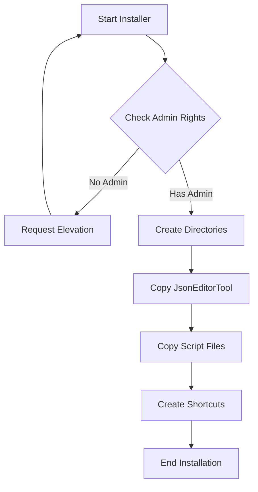
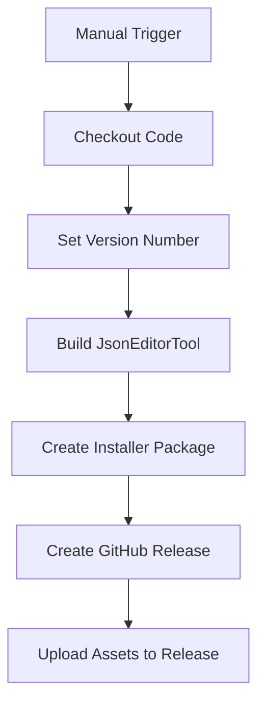

# EndpointPilot Packaging and Release Plan

Based on my review of the EndpointPilot project files and our discussion, I'll outline a comprehensive plan for creating a packaging solution and GitHub release workflow for your project.

## Project Understanding

EndpointPilot is a PowerShell-based Windows Endpoint Configuration solution that:
- Runs as a scheduled task at specified intervals
- Manages user profiles in Office and Remote Work scenarios
- Uses JSON configuration files for operations
- Includes a .NET-based JSON editor tool

## Requirements Summary

1. **Single Installer**:
   - Install JsonEditorTool to `%PROGRAMDATA%\EndpointPilot\JsonEditorTool\`
   - Install main scripts (.ps1, .psm1, .psd1, .json, .cmd, .exe, .vbs) to `%PROGRAMDATA%\EndpointPilot\`
   - Run with admin rights

2. **Cost Constraints**:
   - Free or low-cost solution (open-source project)
   - No commercial installer solutions

3. **GitHub Release Integration**:
   - Semi-automated approach
   - Manually trigger GitHub Actions workflow
   - Automatically build installer and create release

## Installer Solution Options

I've evaluated several free/open-source installer options:

### 1. PowerShell-based Installer (Recommended)

**Pros:**
- Native to the project's technology stack
- Complete control over installation process
- No external dependencies
- Easy to maintain and update
- Can be easily integrated with GitHub Actions

**Cons:**
- Requires script execution policy to be set appropriately
- Less polished UI compared to dedicated installer frameworks

### 2. NSIS (Nullsoft Scriptable Install System)

**Pros:**
- Free and open-source
- Creates professional-looking installers
- Highly customizable
- Well-established with good documentation

**Cons:**
- Requires learning NSIS scripting language
- Additional build dependency
- More complex to maintain

### 3. WiX Toolset (Windows Installer XML)

**Pros:**
- Creates standard MSI packages
- Enterprise-grade solution
- Extensive capabilities

**Cons:**
- Steep learning curve
- XML-based configuration can be verbose
- More complex build process

## Recommended Approach

I recommend using a **PowerShell-based installer** for the following reasons:
1. Aligns with the existing technology stack
2. Simplest to implement and maintain
3. No additional dependencies or costs
4. Easy integration with GitHub Actions
5. Full control over the installation process

## Detailed Implementation Plan

### 1. PowerShell Installer Script

Create a PowerShell script (`Install-EndpointPilot.ps1`) that:



The installer will:
1. Check for and request admin rights if needed
2. Create necessary directories
3. Copy JsonEditorTool files to `%PROGRAMDATA%\EndpointPilot\JsonEditorTool\`
4. Copy script files to `%PROGRAMDATA%\EndpointPilot\`
5. Create shortcuts (optional)
6. Display completion message

### 2. GitHub Actions Workflow

Create a GitHub Actions workflow file (`.github/workflows/release.yml`) that:



The workflow will:
1. Be manually triggered with a version input
2. Check out the latest code
3. Build the JsonEditorTool (if needed)
4. Package all components into a ZIP file
5. Create a GitHub release with the specified version
6. Upload the installer to the release

### 3. Downloader Script (Optional Enhancement)

Create a small PowerShell script that:
1. Downloads the latest release from GitHub
2. Extracts and runs the installer

This provides an easy one-line installation command for users.

## Implementation Details

### PowerShell Installer Script

```powershell
<# 
.SYNOPSIS
    Installer for EndpointPilot
.DESCRIPTION
    Installs EndpointPilot components to the appropriate locations
#>
[CmdletBinding()]
param()

# Ensure running as administrator
if (-not ([Security.Principal.WindowsPrincipal][Security.Principal.WindowsIdentity]::GetCurrent()).IsInRole([Security.Principal.WindowsBuiltInRole]::Administrator)) {
    Write-Warning "This script requires administrator privileges. Attempting to elevate..."
    Start-Process powershell.exe "-NoProfile -ExecutionPolicy Bypass -File `"$PSCommandPath`"" -Verb RunAs
    exit
}

# Define installation paths
$programDataPath = [Environment]::GetFolderPath('CommonApplicationData')
$baseInstallPath = Join-Path -Path $programDataPath -ChildPath "EndpointPilot"
$jsonEditorToolPath = Join-Path -Path $baseInstallPath -ChildPath "JsonEditorTool"

# Create directories if they don't exist
Write-Host "Creating installation directories..." -ForegroundColor Cyan
if (-not (Test-Path -Path $baseInstallPath)) {
    New-Item -Path $baseInstallPath -ItemType Directory -Force | Out-Null
}
if (-not (Test-Path -Path $jsonEditorToolPath)) {
    New-Item -Path $jsonEditorToolPath -ItemType Directory -Force | Out-Null
}

# Install JsonEditorTool
Write-Host "Installing JsonEditorTool..." -ForegroundColor Cyan
$jsonEditorSourcePath = Join-Path -Path $PSScriptRoot -ChildPath "JsonEditorTool\publish"
Copy-Item -Path "$jsonEditorSourcePath\*" -Destination $jsonEditorToolPath -Recurse -Force

# Install script files
Write-Host "Installing EndpointPilot scripts..." -ForegroundColor Cyan
$scriptExtensions = @("*.ps1", "*.psm1", "*.psd1", "*.json", "*.cmd", "*.exe", "*.vbs")
foreach ($extension in $scriptExtensions) {
    $files = Get-ChildItem -Path $PSScriptRoot -Filter $extension -File
    foreach ($file in $files) {
        Copy-Item -Path $file.FullName -Destination $baseInstallPath -Force
    }
}

# Create desktop shortcut (optional)
$createShortcut = Read-Host "Create desktop shortcut for JsonEditorTool? (Y/N)"
if ($createShortcut -eq "Y" -or $createShortcut -eq "y") {
    $WshShell = New-Object -ComObject WScript.Shell
    $Shortcut = $WshShell.CreateShortcut("$env:PUBLIC\Desktop\EndpointPilot JSON Editor.lnk")
    $Shortcut.TargetPath = Join-Path -Path $jsonEditorToolPath -ChildPath "EndpointPilotJsonEditor.App.exe"
    $Shortcut.Save()
    Write-Host "Desktop shortcut created." -ForegroundColor Green
}

Write-Host "EndpointPilot installation complete!" -ForegroundColor Green
Write-Host "JsonEditorTool installed to: $jsonEditorToolPath" -ForegroundColor Yellow
Write-Host "Scripts installed to: $baseInstallPath" -ForegroundColor Yellow
```

### GitHub Actions Workflow

```yaml
name: Create Release

on:
  workflow_dispatch:
    inputs:
      version:
        description: 'Release version (e.g., 1.0.0)'
        required: true
      prerelease:
        description: 'Is this a prerelease?'
        type: boolean
        default: false

jobs:
  build:
    runs-on: windows-latest
    steps:
      - name: Checkout code
        uses: actions/checkout@v3

      - name: Setup .NET
        uses: actions/setup-dotnet@v3
        with:
          dotnet-version: '6.0.x'

      - name: Build JsonEditorTool
        run: |
          cd JsonEditorTool
          dotnet publish EndpointPilotJsonEditor.App/EndpointPilotJsonEditor.App.csproj -c Release -o publish

      - name: Create installer package
        run: |
          # Create the installer script
          $installerContent = Get-Content -Path .github/workflows/Install-EndpointPilot.ps1 -Raw
          Set-Content -Path Install-EndpointPilot.ps1 -Value $installerContent

          # Create release package
          $releaseDir = "EndpointPilot-${{ github.event.inputs.version }}"
          New-Item -Path $releaseDir -ItemType Directory
          
          # Copy files to release directory
          Copy-Item -Path "*.ps1" -Destination $releaseDir
          Copy-Item -Path "*.psm1" -Destination $releaseDir
          Copy-Item -Path "*.psd1" -Destination $releaseDir
          Copy-Item -Path "*.json" -Destination $releaseDir
          Copy-Item -Path "*.cmd" -Destination $releaseDir
          Copy-Item -Path "*.exe" -Destination $releaseDir
          Copy-Item -Path "*.vbs" -Destination $releaseDir
          Copy-Item -Path "JsonEditorTool" -Destination $releaseDir -Recurse
          
          # Create ZIP file
          Compress-Archive -Path $releaseDir -DestinationPath "EndpointPilot-${{ github.event.inputs.version }}.zip"
        shell: pwsh

      - name: Create GitHub Release
        id: create_release
        uses: actions/create-release@v1
        env:
          GITHUB_TOKEN: ${{ secrets.GITHUB_TOKEN }}
        with:
          tag_name: v${{ github.event.inputs.version }}
          release_name: EndpointPilot v${{ github.event.inputs.version }}
          draft: false
          prerelease: ${{ github.event.inputs.prerelease }}

      - name: Upload Release Asset
        uses: actions/upload-release-asset@v1
        env:
          GITHUB_TOKEN: ${{ secrets.GITHUB_TOKEN }}
        with:
          upload_url: ${{ steps.create_release.outputs.upload_url }}
          asset_path: ./EndpointPilot-${{ github.event.inputs.version }}.zip
          asset_name: EndpointPilot-${{ github.event.inputs.version }}.zip
          asset_content_type: application/zip
```

### Downloader Script (Optional)

```powershell
# EndpointPilot Downloader
# Downloads and installs the latest version of EndpointPilot

[CmdletBinding()]
param(
    [string]$Version = "latest"
)

# Ensure running as administrator
if (-not ([Security.Principal.WindowsPrincipal][Security.Principal.WindowsIdentity]::GetCurrent()).IsInRole([Security.Principal.WindowsBuiltInRole]::Administrator)) {
    Write-Warning "This script requires administrator privileges. Attempting to elevate..."
    Start-Process powershell.exe "-NoProfile -ExecutionPolicy Bypass -File `"$PSCommandPath`"" -Verb RunAs
    exit
}

$tempDir = Join-Path -Path $env:TEMP -ChildPath "EndpointPilotInstall"
if (Test-Path $tempDir) {
    Remove-Item -Path $tempDir -Recurse -Force
}
New-Item -Path $tempDir -ItemType Directory -Force | Out-Null

Write-Host "Downloading EndpointPilot..." -ForegroundColor Cyan

if ($Version -eq "latest") {
    $releaseUrl = "https://api.github.com/repos/J-DubApps/EndpointPilot/releases/latest"
    $release = Invoke-RestMethod -Uri $releaseUrl
    $downloadUrl = $release.assets[0].browser_download_url
} else {
    $downloadUrl = "https://github.com/J-DubApps/EndpointPilot/releases/download/v$Version/EndpointPilot-$Version.zip"
}

$zipPath = Join-Path -Path $tempDir -ChildPath "EndpointPilot.zip"
Invoke-WebRequest -Uri $downloadUrl -OutFile $zipPath

Write-Host "Extracting files..." -ForegroundColor Cyan
Expand-Archive -Path $zipPath -DestinationPath $tempDir -Force

# Find the installer script
$installerPath = Get-ChildItem -Path $tempDir -Filter "Install-EndpointPilot.ps1" -Recurse | Select-Object -First 1 -ExpandProperty FullName

if ($installerPath) {
    Write-Host "Running installer..." -ForegroundColor Cyan
    & $installerPath
} else {
    Write-Error "Installer script not found in the downloaded package."
}
```

## GitHub Release Strategy

The GitHub release process will work as follows:

1. When ready to create a new release, the developer manually triggers the GitHub Actions workflow
2. The workflow prompts for a version number and whether it's a prerelease
3. GitHub Actions builds the JsonEditorTool, packages all components, and creates a release
4. The release includes:
   - The installer package (ZIP file)
   - Release notes (automatically generated from commit messages or manually added)
   - Version information

## Next Steps

1. **Create the installer script** (`Install-EndpointPilot.ps1`)
2. **Set up the GitHub Actions workflow** (`.github/workflows/release.yml`)
3. **Test the installation process** on different Windows versions
4. **Create documentation** for the installation process
5. **Implement the optional downloader script** for easy installation

## Future Enhancements

1. **Versioning system**: Automatically increment version numbers based on semantic versioning
2. **Changelog generation**: Automatically generate release notes from commit messages
3. **Installation verification**: Add checks to verify successful installation
4. **Uninstaller**: Create an uninstaller script
5. **Update mechanism**: Add ability to check for and install updates