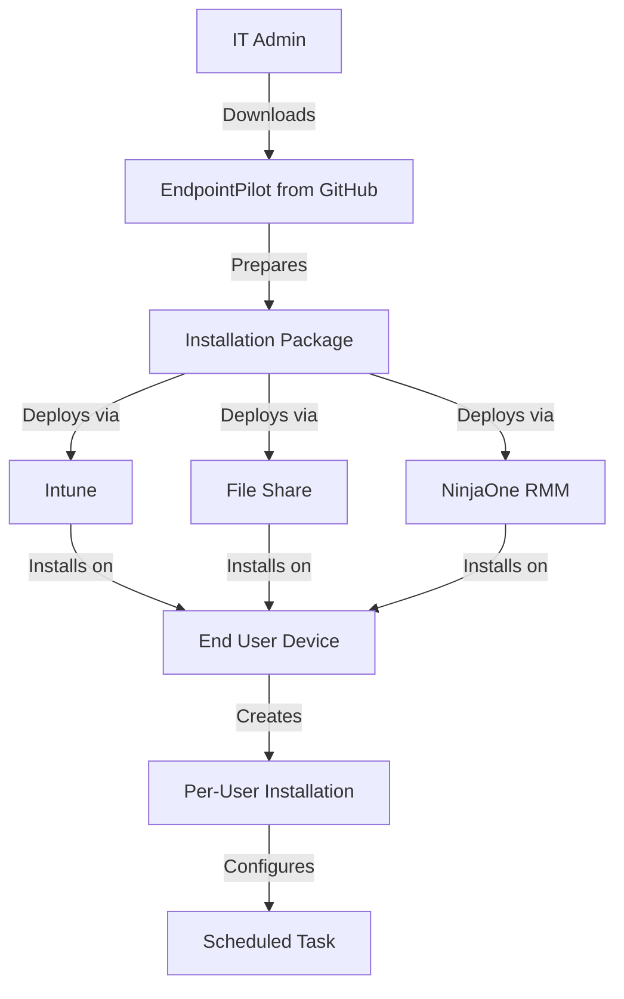
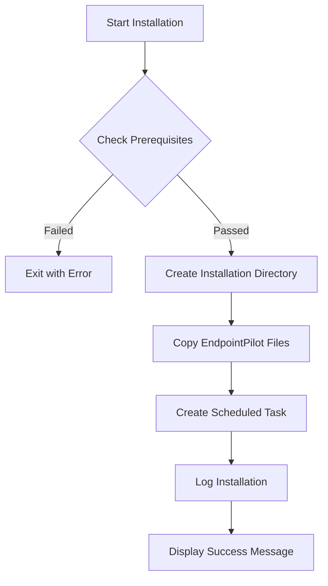
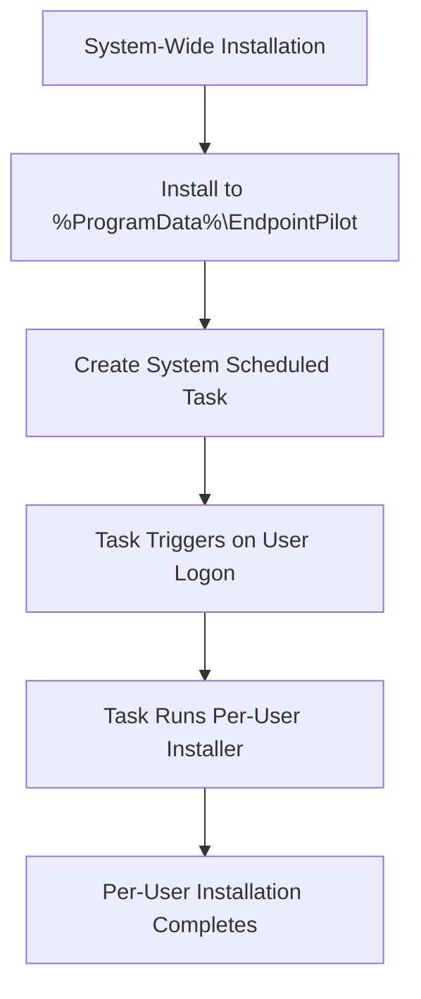
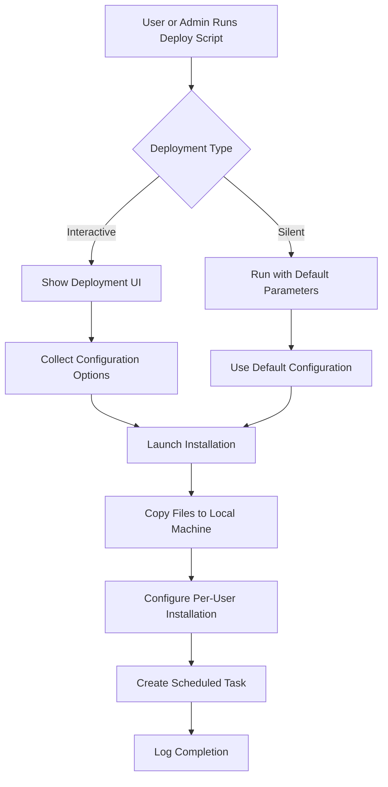
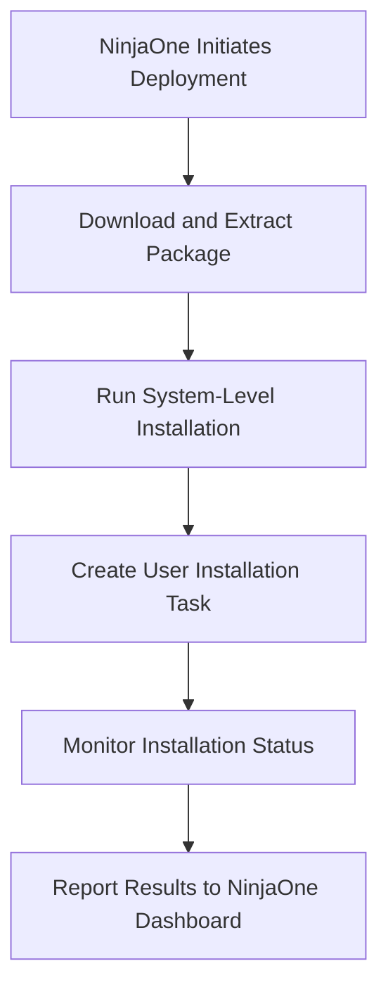

# EndpointPilot Installation Solution Plan

## Executive Summary

This document outlines a comprehensive installation solution for EndpointPilot, a PowerShell-based Windows Endpoint Configuration Tool designed for PCs in AD, Intune, or NinjaOne-managed environments. The solution addresses the need for a reliable deployment mechanism that works in both cloud-managed (Intune) and traditional on-premises (AD-only) scenarios.

### Key Objectives

- Create a flexible installation package that can be deployed from Intune, a file share, or NinjaOne RMM
- Support per-user installation with default configurations that can be modified post-installation
- Provide comprehensive logging, error handling, and troubleshooting capabilities
- Establish a robust update management strategy for ongoing maintenance

### Deployment Options

The plan details three primary deployment methods:

1. **Intune Deployment**: A Win32 app with a system-wide installer that creates a login script/scheduled task to handle per-user installation, ideal for cloud-managed environments with remote/hybrid workers.

2. **File Share Deployment**: A network share-based solution with multiple deployment mechanisms (GPO, logon script, manual), suitable for traditional AD-managed environments without Intune.

3. **NinjaOne Deployment**: A deployment solution leveraging NinjaOne's application deployment and PowerShell scripting capabilities, designed for organizations using this RMM platform to manage their endpoints.

### Expected Outcomes

Implementation of this plan will result in:

- A standardized, reliable installation process for EndpointPilot
- Reduced administrative overhead through automation
- Improved user experience with silent installation options
- Simplified ongoing maintenance with clear update paths
- Comprehensive documentation for IT administrators

This installation solution will ensure EndpointPilot can be effectively deployed and maintained across diverse organizational environments, supporting both modern cloud-managed and traditional on-premises infrastructure.

This document outlines a comprehensive plan for creating an installation solution for EndpointPilot that can be deployed from either Microsoft Intune or an on-premises file share in an AD-only scenario.

## Table of Contents

- [Executive Summary](#executive-summary)
- [Overview](#overview)
- [1. Installation Package Structure](#1-installation-package-structure)
- [2. Installation Script Design](#2-installation-script-design)
- [3. Intune Deployment Method (Detailed)](#3-intune-deployment-method-detailed)
  - [3.1 Preparing the Intune Package](#31-preparing-the-intune-package)
  - [3.2 Configuring the Intune App](#32-configuring-the-intune-app)
  - [3.3 Detection Rules](#33-detection-rules)
  - [3.4 System-Wide Installer Script Design](#34-system-wide-installer-script-design)
  - [3.5 Per-User Installation Script](#35-per-user-installation-script)
  - [3.6 Deployment Options in Intune](#36-deployment-options-in-intune)
  - [3.7 User Experience](#37-user-experience)
  - [3.8 Troubleshooting Intune Deployment](#38-troubleshooting-intune-deployment)
- [4. File Share Deployment Method (Detailed)](#4-file-share-deployment-method-detailed)
  - [4.1 Preparing the File Share](#41-preparing-the-file-share)
  - [4.2 Deployment Package Structure](#42-deployment-package-structure)
  - [4.3 Deployment Script Design](#43-deployment-script-design)
  - [4.4 Deployment Methods](#44-deployment-methods)
  - [4.5 User Experience](#45-user-experience)
  - [4.6 Logging and Reporting](#46-logging-and-reporting)
  - [4.7 Troubleshooting File Share Deployment](#47-troubleshooting-file-share-deployment)
  - [4.8 Security Considerations for File Share Deployment](#48-security-considerations-for-file-share-deployment)
- [5. NinjaOne Deployment Method (Detailed)](#5-ninjaone-deployment-method-detailed)
  - [5.1 NinjaOne Platform Overview](#51-ninjaone-platform-overview)
  - [5.2 Deployment Package Preparation](#52-deployment-package-preparation)
  - [5.3 Deployment Script Design](#53-deployment-script-design)
  - [5.4 NinjaOne Deployment Configuration](#54-ninjaone-deployment-configuration)
  - [5.5 User Experience](#55-user-experience)
  - [5.6 Logging and Reporting](#56-logging-and-reporting)
  - [5.7 Troubleshooting NinjaOne Deployment](#57-troubleshooting-ninjaone-deployment)
  - [5.8 Security Considerations](#58-security-considerations)
- [6. Configuration Management](#6-configuration-management)
- [7. Logging and Telemetry](#7-logging-and-telemetry)
- [8. Security Considerations](#8-security-considerations)
- [9. Testing Strategy](#9-testing-strategy)
- [10. Documentation](#10-documentation)
- [11. Implementation Plan](#11-implementation-plan)
- [12. Deployment Method Comparison](#12-deployment-method-comparison)
  - [12.1 Comparison Table](#121-comparison-table)
  - [12.2 Intune Deployment: Pros and Cons](#122-intune-deployment-pros-and-cons)
  - [12.3 File Share Deployment: Pros and Cons](#123-file-share-deployment-pros-and-cons)
  - [12.4 NinjaOne Deployment: Pros and Cons](#124-ninjaone-deployment-pros-and-cons)
  - [12.5 Hybrid Approach Considerations](#125-hybrid-approach-considerations)
  - [12.6 Decision Framework](#126-decision-framework)
- [13. Update Management Strategy](#13-update-management-strategy)
  - [13.1 Version Management](#131-version-management)
  - [13.2 Update Mechanisms for Intune Deployment](#132-update-mechanisms-for-intune-deployment)
  - [13.3 Update Mechanisms for File Share Deployment](#133-update-mechanisms-for-file-share-deployment)
  - [13.4 Update Mechanisms for NinjaOne Deployment](#134-update-mechanisms-for-ninjaone-deployment)
  - [13.5 Configuration Persistence During Updates](#135-configuration-persistence-during-updates)
  - [13.6 Rollback Procedures](#136-rollback-procedures)
  - [13.7 Update Notification and Documentation](#137-update-notification-and-documentation)
  - [13.8 Update Testing Strategy](#138-update-testing-strategy)

## Overview



## 1. Installation Package Structure

The installation package will consist of:

```
EndpointPilot-Installer/
├── Install/
│   ├── EndpointPilot/                 # Pre-downloaded EndpointPilot files
│   │   ├── ENDPOINT-PILOT.PS1
│   │   ├── MAIN.PS1
│   │   ├── CONFIG.json
│   │   ├── MGMT-*.ps1 files
│   │   ├── *-OPS.json files
│   │   └── ...
│   ├── Install-EndpointPilot.ps1      # Main installation script
│   ├── Uninstall-EndpointPilot.ps1    # Uninstallation script
│   └── EndpointPilot-Config.xml       # Optional configuration template
├── Intune/
│   ├── Create-IntunePackage.ps1       # Script to create Intune package
│   ├── Detection.ps1                  # Intune detection script
│   └── README.md                      # Intune deployment instructions
├── FileShare/
│   ├── Deploy-FromFileShare.ps1       # Script for file share deployment
│   └── README.md                      # File share deployment instructions
└── NinjaOne/
    ├── Install-EndpointPilot-NinjaOne.ps1  # NinjaOne deployment script
    ├── Detection.ps1                       # NinjaOne detection script
    └── README.md                           # NinjaOne deployment instructions
```

## 2. Installation Script Design

The main installation script (`Install-EndpointPilot.ps1`) will:

1. Check prerequisites (PowerShell version, OS compatibility)
2. Create the per-user installation directory (%LOCALAPPDATA%\EndpointPilot)
3. Copy all EndpointPilot files to the installation directory
4. Create the scheduled task for the current user
5. Log installation details
6. Provide feedback on successful installation



## 3. Intune Deployment Method (Detailed)

For Intune deployment, we'll create a Win32 app with a system-wide installer that creates a login script/scheduled task to handle per-user installation. This approach allows for a single deployment that works for all users on a device.

### 3.1 Preparing the Intune Package

#### 3.1.1 System-Wide Installer Components

The system-wide installer will consist of:

1. **System-Level Files** (installed to `%ProgramData%\EndpointPilot\`):
   - EndpointPilot source files (all PS1 and JSON files)
   - Configuration templates
   - Logging framework

2. **User Installation Mechanism**:
   - A scheduled task that runs at user logon
   - A PowerShell script that performs the per-user installation



#### 3.1.2 Creating the .intunewin Package

1. **Prepare the Source Files**:
   - Create a folder structure for the installer
   - Include all EndpointPilot files
   - Add the system-wide installer script
   - Add the per-user installation script

2. **Use the Microsoft Win32 Content Prep Tool**:
   ```powershell
   IntuneWinAppUtil.exe -c ".\EndpointPilot-Installer\Install" -s "Install-EndpointPilot-System.ps1" -o ".\Output"
   ```

3. **Package Contents Verification**:
   - Verify the .intunewin file is created correctly
   - Test extraction to ensure all files are included

### 3.2 Configuring the Intune App

#### 3.2.1 Basic App Information

- **Name**: EndpointPilot Configuration Tool
- **Description**: A PowerShell-based Windows Endpoint Configuration Tool for PCs in AD or Intune-managed environments
- **Publisher**: Your Organization
- **Logo**: EndpointPilot logo (optional)
- **Category**: Configuration

#### 3.2.2 Program Settings

- **Install Command**:
  ```
  powershell.exe -ExecutionPolicy Bypass -File "Install-EndpointPilot-System.ps1"
  ```

- **Uninstall Command**:
  ```
  powershell.exe -ExecutionPolicy Bypass -File "Uninstall-EndpointPilot-System.ps1"
  ```

- **Install Behavior**: System (install for all users)
- **Device Restart Behavior**: No specific action

#### 3.2.3 Requirements

- **Operating System Architecture**: 64-bit
- **Minimum Operating System**: Windows 10 1809 or later
- **Disk Space Required**: 50 MB

### 3.3 Detection Rules

The detection script will check for the presence of system-wide components:

```powershell
# Detection.ps1
$installPath = "$env:ProgramData\EndpointPilot"
$mainScript = "$installPath\ENDPOINT-PILOT.PS1"
$configFile = "$installPath\CONFIG.json"
$scheduledTask = Get-ScheduledTask -TaskName "EndpointPilot-UserInstaller" -ErrorAction SilentlyContinue

if ((Test-Path $mainScript) -and (Test-Path $configFile) -and ($scheduledTask -ne $null)) {
    # Application is installed
    Write-Output "EndpointPilot is installed"
    exit 0
} else {
    # Application is not installed
    exit 1
}
```

Configure in Intune as a custom detection script.

### 3.4 System-Wide Installer Script Design

The system-wide installer script (`Install-EndpointPilot-System.ps1`) will:

1. Check for administrative privileges
2. Verify OS compatibility
3. Create the system-wide installation directory (%ProgramData%\EndpointPilot)
4. Copy all EndpointPilot files to the system directory
5. Create a scheduled task that runs at user logon to perform per-user installation
6. Log installation details

```powershell
# Key components of Install-EndpointPilot-System.ps1

# Check for admin rights
if (-not ([Security.Principal.WindowsPrincipal][Security.Principal.WindowsIdentity]::GetCurrent()).IsInRole([Security.Principal.WindowsBuiltInRole]::Administrator)) {
    Write-Error "This script must be run as Administrator"
    exit 1
}

# Create system directory
$systemDir = "$env:ProgramData\EndpointPilot"
New-Item -Path $systemDir -ItemType Directory -Force | Out-Null

# Copy files
Copy-Item -Path ".\EndpointPilot\*" -Destination $systemDir -Recurse -Force

# Create per-user installer task
$action = New-ScheduledTaskAction -Execute "powershell.exe" -Argument "-ExecutionPolicy Bypass -File `"$systemDir\Install-EndpointPilot-User.ps1`""
$trigger = New-ScheduledTaskTrigger -AtLogOn
$principal = New-ScheduledTaskPrincipal -GroupId "Users"
$settings = New-ScheduledTaskSettingsSet -AllowStartIfOnBatteries -DontStopIfGoingOnBatteries
Register-ScheduledTask -TaskName "EndpointPilot-UserInstaller" -Action $action -Trigger $trigger -Principal $principal -Settings $settings -Description "Installs EndpointPilot for each user at logon"
```

### 3.5 Per-User Installation Script

The per-user installation script (`Install-EndpointPilot-User.ps1`) will:

1. Check if EndpointPilot is already installed for the current user
2. Create the per-user installation directory (%LOCALAPPDATA%\EndpointPilot)
3. Copy necessary files from the system directory
4. Create the EndpointPilot scheduled task for the current user
5. Log installation details

```powershell
# Key components of Install-EndpointPilot-User.ps1

# Check if already installed
$userDir = "$env:LOCALAPPDATA\EndpointPilot"
if (Test-Path "$userDir\ENDPOINT-PILOT.PS1") {
    # Already installed, check if update needed
    # Compare file versions/dates and update if needed
}

# Create user directory
New-Item -Path $userDir -ItemType Directory -Force | Out-Null

# Copy necessary files from system directory
$systemDir = "$env:ProgramData\EndpointPilot"
Copy-Item -Path "$systemDir\ENDPOINT-PILOT.PS1" -Destination $userDir
Copy-Item -Path "$systemDir\MAIN.PS1" -Destination $userDir
# Copy other required files...

# Create EndpointPilot scheduled task
# (Similar to the task creation in MGMT-SchedTsk.ps1)
```

### 3.6 Deployment Options in Intune

#### 3.6.1 Assignment Options

- **Available for enrolled devices**: Makes the app available in Company Portal
- **Required**: Automatically installs on targeted devices
- **Uninstall**: Removes the app if it was previously installed

#### 3.6.2 Target Groups

- **User Groups**: Assign to specific Azure AD user groups
- **Device Groups**: Assign to specific device groups
- **Filters**: Use filters to refine targeting (e.g., only Windows 10/11 Enterprise)

#### 3.6.3 Delivery Optimization

- Configure delivery optimization to reduce bandwidth usage
- Set download deadlines and retry counts

### 3.7 User Experience

1. **System Installation**: Silent installation of system components
2. **First Logon**: Per-user components installed automatically
3. **Notification**: Optional toast notification when installation completes
4. **Scheduled Task**: EndpointPilot runs at configured intervals

### 3.8 Troubleshooting Intune Deployment

#### 3.8.1 Logging

- System installer logs: `%ProgramData%\EndpointPilot\Logs\System-Install.log`
- Per-user installer logs: `%LOCALAPPDATA%\EndpointPilot\Logs\User-Install.log`
- Intune Management Extension logs: `%ProgramData%\Microsoft\IntuneManagementExtension\Logs`

#### 3.8.2 Common Issues and Resolutions

- **Installation Failure**: Check logs for specific errors
- **Detection Rule Failure**: Verify detection script logic
- **Task Scheduler Issues**: Check permissions and task configuration
- **File Copy Errors**: Verify source files and permissions

#### 3.8.3 Remediation

- **Manual Repair Script**: Include a repair script that can fix common issues
- **Reinstallation Process**: Document the steps to cleanly reinstall

## 4. File Share Deployment Method (Detailed)

For environments without Intune (AD-only scenarios), we'll create a comprehensive file share deployment solution that allows IT administrators to deploy EndpointPilot from a centralized network location.

### 4.1 Preparing the File Share

#### 4.1.1 File Share Requirements

- **Share Location**: Create a dedicated network share on a server accessible to all target users
- **Permissions**:
  - IT Administrators: Full Control
  - Target Users: Read and Execute permissions
- **Share Name**: Use a descriptive name (e.g., `\\server\EndpointPilot`)
- **Folder Structure**: Create a well-organized structure to facilitate deployment and updates

```
\\server\EndpointPilot\
├── Installer\                 # Current version installer
├── Archives\                  # Previous versions
├── Logs\                      # Centralized installation logs
└── Documentation\             # Deployment guides and documentation
```

#### 4.1.2 Network Considerations

- **Bandwidth**: Ensure sufficient bandwidth for multiple simultaneous installations
- **Availability**: Consider redundancy options for critical deployments
- **Firewall Rules**: Verify necessary firewall rules are in place for SMB access

### 4.2 Deployment Package Structure

The file share deployment package will be organized as follows:

```
\\server\EndpointPilot\Installer\
├── EndpointPilot\                 # Pre-downloaded EndpointPilot files
│   ├── ENDPOINT-PILOT.PS1
│   ├── MAIN.PS1
│   ├── CONFIG.json
│   ├── MGMT-*.ps1 files
│   ├── *-OPS.json files
│   └── ...
├── Scripts\
│   ├── Deploy-EndpointPilot.ps1   # Main deployment script
│   ├── Install-EndpointPilot.ps1  # Per-user installation script
│   ├── Install-System.ps1         # Optional system-wide components
│   └── Uninstall-EndpointPilot.ps1
├── Templates\
│   └── CONFIG-Template.json       # Template for customized configurations
└── README.txt                     # Deployment instructions
```

### 4.3 Deployment Script Design

The file share deployment will use a multi-stage approach:



#### 4.3.1 Main Deployment Script

The `Deploy-EndpointPilot.ps1` script will serve as the entry point for deployment:

```powershell
# Key components of Deploy-EndpointPilot.ps1

param(
    [switch]$Silent,
    [string]$ConfigTemplate = "Default",
    [switch]$SystemWide,
    [switch]$LogToServer = $true
)

# Script banner and information
Write-Host "EndpointPilot Deployment Tool" -ForegroundColor Cyan
Write-Host "--------------------------------" -ForegroundColor Cyan

# Determine execution context
$isAdmin = ([Security.Principal.WindowsPrincipal][Security.Principal.WindowsIdentity]::GetCurrent()).IsInRole([Security.Principal.WindowsBuiltInRole]::Administrator)

# Interactive mode if not silent
if (-not $Silent) {
    # Show deployment options UI (PowerShell forms or console menu)
    # Allow selection of configuration template
    # Confirm installation options
}

# Determine installation type based on context and parameters
if ($SystemWide -and $isAdmin) {
    # System-wide installation
    & "$PSScriptRoot\Scripts\Install-System.ps1" -ConfigTemplate $ConfigTemplate -LogToServer:$LogToServer
} else {
    # Per-user installation
    & "$PSScriptRoot\Scripts\Install-EndpointPilot.ps1" -ConfigTemplate $ConfigTemplate -LogToServer:$LogToServer
}
```

#### 4.3.2 Installation Script

The per-user installation script will handle the actual installation process:

```powershell
# Key components of Install-EndpointPilot.ps1

param(
    [string]$ConfigTemplate = "Default",
    [switch]$LogToServer = $true
)

# Set up logging
$logFile = "$env:TEMP\EndpointPilot-Install-$(Get-Date -Format 'yyyyMMdd-HHmmss').log"
Start-Transcript -Path $logFile -Append

try {
    # Create user installation directory
    $userDir = "$env:LOCALAPPDATA\EndpointPilot"
    New-Item -Path $userDir -ItemType Directory -Force | Out-Null
    
    # Copy EndpointPilot files
    $sourceDir = "$PSScriptRoot\..\EndpointPilot"
    Copy-Item -Path "$sourceDir\*" -Destination $userDir -Recurse -Force
    
    # Apply configuration template if specified
    if ($ConfigTemplate -ne "Default") {
        $templatePath = "$PSScriptRoot\..\Templates\$ConfigTemplate.json"
        if (Test-Path $templatePath) {
            Copy-Item -Path $templatePath -Destination "$userDir\CONFIG.json" -Force
        }
    }
    
    # Create scheduled task
    & "$userDir\MGMT-SchedTsk.ps1"
    
    # Copy log to server if requested
    if ($LogToServer) {
        $networkLogDir = "\\server\EndpointPilot\Logs\$env:COMPUTERNAME"
        if (Test-Path "\\server\EndpointPilot\Logs") {
            if (-not (Test-Path $networkLogDir)) {
                New-Item -Path $networkLogDir -ItemType Directory -Force | Out-Null
            }
            Copy-Item -Path $logFile -Destination "$networkLogDir\$(Split-Path $logFile -Leaf)" -Force
        }
    }
    
    Write-Host "EndpointPilot installation completed successfully!" -ForegroundColor Green
} catch {
    Write-Host "Error during installation: $_" -ForegroundColor Red
} finally {
    Stop-Transcript
}
```

### 4.4 Deployment Methods

#### 4.4.1 Group Policy Software Installation

For domain-joined computers, Group Policy can be used to deploy the installation script:

1. **Create a GPO**:
   - Navigate to Computer Configuration > Policies > Windows Settings > Scripts
   - Add a startup script that calls the deployment script with appropriate parameters

2. **Script Parameters**:
   ```
   powershell.exe -ExecutionPolicy Bypass -File "\\server\EndpointPilot\Installer\Scripts\Deploy-EndpointPilot.ps1" -Silent -SystemWide
   ```

3. **Targeting**:
   - Apply the GPO to specific OUs containing target computers
   - Use WMI filtering to target specific machine types if needed

#### 4.4.2 Logon Script Deployment

For per-user deployment via logon scripts:

1. **Create a GPO**:
   - Navigate to User Configuration > Policies > Windows Settings > Scripts
   - Add a logon script that calls the deployment script

2. **Script Parameters**:
   ```
   powershell.exe -ExecutionPolicy Bypass -File "\\server\EndpointPilot\Installer\Scripts\Deploy-EndpointPilot.ps1" -Silent
   ```

3. **Targeting**:
   - Apply the GPO to specific user groups or OUs

#### 4.4.3 Manual Deployment

For manual or targeted deployments:

1. **Create a Shortcut**:
   - Create a shortcut to the deployment script on the desktop or Start Menu
   - Configure to run with PowerShell with appropriate parameters

2. **Email Instructions**:
   - Send users a link to the network location
   - Provide clear instructions on how to run the installer

3. **Self-Service Portal**:
   - Add the deployment script to a self-service software portal if available

### 4.5 User Experience

The deployment process can be configured for different user experiences:

#### 4.5.1 Silent Installation

- No user interaction required
- Installation happens in the background
- Optional notification upon completion

#### 4.5.2 Interactive Installation

- Presents a simple UI for configuration options
- Shows progress during installation
- Provides feedback upon completion

#### 4.5.3 Guided Installation

- Step-by-step wizard for more complex deployments
- Allows selection of components and configuration options
- Provides detailed feedback and next steps

### 4.6 Logging and Reporting

Comprehensive logging will help track deployments and troubleshoot issues:

#### 4.6.1 Local Logging

- Installation logs stored in `%TEMP%` directory
- Detailed transcript of all installation steps
- Error logging with context information

#### 4.6.2 Centralized Logging

- Option to copy logs to central network share
- Organized by computer name and timestamp
- Facilitates fleet-wide deployment monitoring

#### 4.6.3 Deployment Reporting

- Optional script to generate deployment reports
- Track successful vs. failed installations
- Identify common issues across multiple machines

### 4.7 Troubleshooting File Share Deployment

#### 4.7.1 Common Issues and Solutions

1. **Network Access Problems**:
   - Verify network connectivity to the file share
   - Check user permissions on the share
   - Test with basic file access before running scripts

2. **Script Execution Policy**:
   - Ensure appropriate execution policy is set
   - Use `-ExecutionPolicy Bypass` parameter
   - Consider signing scripts for enhanced security

3. **File Copy Failures**:
   - Check disk space on target machine
   - Verify write permissions to destination folders
   - Look for file locks or in-use files

4. **Scheduled Task Creation Issues**:
   - Verify user has rights to create scheduled tasks
   - Check for existing tasks with the same name
   - Review task scheduler logs

#### 4.7.2 Remediation Tools

1. **Repair Script**:
   - Include a repair script to fix common issues
   - Ability to reset configuration to defaults
   - Option to recreate scheduled tasks

2. **Diagnostic Tool**:
   - Script to collect system information and logs
   - Verify prerequisites and permissions
   - Generate diagnostic report for IT support

### 4.8 Security Considerations for File Share Deployment

1. **Script Signing**:
   - Sign all PowerShell scripts with a trusted certificate
   - Configure clients to require signed scripts
   - Verify signature before execution

2. **Least Privilege**:
   - Run installation with minimal required permissions
   - Avoid using domain admin credentials for deployment
   - Use dedicated service accounts where appropriate

3. **Network Share Security**:
   - Restrict access to authorized users only
   - Use NTFS permissions to control access
   - Consider encrypting sensitive configuration files

4. **Audit Logging**:
   - Enable auditing on the file share
   - Track access and execution of deployment scripts
   - Monitor for unauthorized access attempts
## 5. NinjaOne Deployment Method (Detailed)

For organizations using NinjaOne as their Remote Monitoring and Management (RMM) platform, this section outlines a comprehensive deployment approach leveraging NinjaOne's application deployment and PowerShell scripting capabilities.

### 5.1 NinjaOne Platform Overview

NinjaOne (formerly NinjaRMM) is a cloud-based remote monitoring and management platform that provides:

- **Application Deployment**: Ability to deploy software packages to managed endpoints
- **PowerShell Scripting**: Capability to run PowerShell scripts with system privileges
- **Scheduled Tasks**: Functionality to create and manage scheduled tasks
- **Monitoring**: Monitoring of deployment success/failure and endpoint health
- **Reporting**: Detailed reporting on deployment status and endpoint configurations

These capabilities make NinjaOne well-suited for deploying EndpointPilot across multiple endpoints in a controlled, monitored manner.

### 5.2 Deployment Package Preparation

#### 5.2.1 Package Structure

Create a deployment package specifically optimized for NinjaOne:

```
EndpointPilot-NinjaOne/
├── EndpointPilot/                 # Pre-downloaded EndpointPilot files
│   ├── ENDPOINT-PILOT.PS1
│   ├── MAIN.PS1
│   ├── CONFIG.json
│   ├── MGMT-*.ps1 files
│   ├── *-OPS.json files
│   └── ...
├── Scripts/
│   ├── Install-EndpointPilot-System.ps1  # System-level installation script
│   ├── Install-EndpointPilot-User.ps1    # Per-user installation script
│   ├── Uninstall-EndpointPilot.ps1       # Uninstallation script
│   └── Test-EndpointPilotInstallation.ps1 # Validation script
└── README.md                      # Deployment instructions
```

#### 5.2.2 Package Compression

NinjaOne typically works with compressed packages for application deployment:

1. **Create ZIP Package**:
   - Compress the EndpointPilot-NinjaOne folder into a ZIP file
   - Ensure the ZIP structure preserves the folder hierarchy
   - Optimize the ZIP for faster deployment

2. **Package Hosting**:
   - Host the ZIP package on a reliable file server or cloud storage
   - Ensure the hosting location is accessible to NinjaOne
   - Consider using version-specific URLs for update management

### 5.3 Deployment Script Design

The deployment will use a multi-stage approach with PowerShell scripts:



#### 5.3.1 Main Deployment Script

The primary script that NinjaOne will execute:

```powershell
# Install-EndpointPilot-NinjaOne.ps1

param(
    [string]$PackageUrl = "https://your-storage/EndpointPilot-NinjaOne.zip",
    [string]$InstallPath = "$env:ProgramData\EndpointPilot",
    [switch]$Force
)

# Set up logging
$logFile = "$env:ProgramData\NinjaRMM\Logs\EndpointPilot-Install-$(Get-Date -Format 'yyyyMMdd-HHmmss').log"
Start-Transcript -Path $logFile -Append

try {
    # Create installation directory
    if (-not (Test-Path $InstallPath)) {
        New-Item -Path $InstallPath -ItemType Directory -Force | Out-Null
        Write-Output "Created installation directory: $InstallPath"
    }
    
    # Download and extract package
    $tempZip = "$env:TEMP\EndpointPilot-NinjaOne.zip"
    Invoke-WebRequest -Uri $PackageUrl -OutFile $tempZip
    Write-Output "Downloaded package from $PackageUrl"
    
    # Extract package
    Expand-Archive -Path $tempZip -DestinationPath "$env:TEMP\EndpointPilot-Extract" -Force
    Write-Output "Extracted package to temporary location"
    
    # Copy files to installation directory
    Copy-Item -Path "$env:TEMP\EndpointPilot-Extract\EndpointPilot\*" -Destination $InstallPath -Recurse -Force
    Copy-Item -Path "$env:TEMP\EndpointPilot-Extract\Scripts\*" -Destination $InstallPath -Recurse -Force
    Write-Output "Copied files to installation directory"
    
    # Run system-level installation
    & "$InstallPath\Install-EndpointPilot-System.ps1" -Force:$Force
    Write-Output "Completed system-level installation"
    
    # Clean up
    Remove-Item -Path $tempZip -Force -ErrorAction SilentlyContinue
    Remove-Item -Path "$env:TEMP\EndpointPilot-Extract" -Recurse -Force -ErrorAction SilentlyContinue
    Write-Output "Cleaned up temporary files"
    
    # Return success for NinjaOne reporting
    Write-Output "EndpointPilot installation completed successfully"
    exit 0
}
catch {
    Write-Error "Error during installation: $_"
    exit 1
}
finally {
    Stop-Transcript
}
```

#### 5.3.2 System-Level Installation Script

This script handles the system-wide components:

```powershell
# Install-EndpointPilot-System.ps1

param(
    [switch]$Force
)

# Create scheduled task for per-user installation
$action = New-ScheduledTaskAction -Execute "powershell.exe" -Argument "-ExecutionPolicy Bypass -File `"$env:ProgramData\EndpointPilot\Install-EndpointPilot-User.ps1`""
$trigger = New-ScheduledTaskTrigger -AtLogOn
$principal = New-ScheduledTaskPrincipal -GroupId "Users"
$settings = New-ScheduledTaskSettingsSet -AllowStartIfOnBatteries -DontStopIfGoingOnBatteries

# Register or update the task
$taskName = "EndpointPilot-UserInstaller"
$existingTask = Get-ScheduledTask -TaskName $taskName -ErrorAction SilentlyContinue

if ($existingTask -and -not $Force) {
    Write-Output "Task already exists. Use -Force to replace it."
} else {
    if ($existingTask) {
        Unregister-ScheduledTask -TaskName $taskName -Confirm:$false
    }
    Register-ScheduledTask -TaskName $taskName -Action $action -Trigger $trigger -Principal $principal -Settings $settings -Description "Installs EndpointPilot for each user at logon"
    Write-Output "Created scheduled task for per-user installation"
}
```

#### 5.3.3 Per-User Installation Script

This script handles the per-user installation:

```powershell
# Install-EndpointPilot-User.ps1

# Create user installation directory
$userDir = "$env:LOCALAPPDATA\EndpointPilot"
if (-not (Test-Path $userDir)) {
    New-Item -Path $userDir -ItemType Directory -Force | Out-Null
}

# Copy necessary files from system directory
$systemDir = "$env:ProgramData\EndpointPilot"
Copy-Item -Path "$systemDir\ENDPOINT-PILOT.PS1" -Destination $userDir -Force
Copy-Item -Path "$systemDir\MAIN.PS1" -Destination $userDir -Force
Copy-Item -Path "$systemDir\CONFIG.json" -Destination $userDir -Force
Copy-Item -Path "$systemDir\MGMT-*.ps1" -Destination $userDir -Force
Copy-Item -Path "$systemDir\*-OPS.json" -Destination $userDir -Force

# Create EndpointPilot scheduled task for current user
# (Similar to the task creation in MGMT-SchedTsk.ps1)
```

### 5.4 NinjaOne Deployment Configuration

#### 5.4.1 Creating the Deployment in NinjaOne

1. **Navigate to Application Management**:
   - Log in to the NinjaOne dashboard
   - Navigate to the Application Management section

2. **Create New Application**:
   - Name: EndpointPilot
   - Description: PowerShell-based Windows Endpoint Configuration Tool
   - Version: [Current Version]
   - Publisher: Your Organization

3. **Configure Installation**:
   - Installation Type: Script
   - Script Type: PowerShell
   - Script Content: Use the Install-EndpointPilot-NinjaOne.ps1 script
   - Run As: System
   - Timeout: 15 minutes (adjust as needed)

4. **Configure Uninstallation**:
   - Script Type: PowerShell
   - Script Content: Use the Uninstall-EndpointPilot.ps1 script
   - Run As: System

5. **Detection Method**:
   - Detection Type: Script
   - Script Type: PowerShell
   - Script Content:
     ```powershell
     if (Test-Path "$env:ProgramData\EndpointPilot\ENDPOINT-PILOT.PS1") {
         exit 0  # Installed
     } else {
         exit 1  # Not installed
     }
     ```

#### 5.4.2 Deployment Targeting

NinjaOne provides several options for targeting deployments:

1. **Organization-Wide Deployment**:
   - Deploy to all managed devices in the organization

2. **Group-Based Deployment**:
   - Create device groups in NinjaOne
   - Target specific groups for deployment

3. **Filter-Based Deployment**:
   - Use NinjaOne's filtering capabilities
   - Target based on OS, hardware, location, etc.

4. **Staged Deployment**:
   - Create multiple deployment policies
   - Roll out to test groups before wider deployment

#### 5.4.3 Deployment Scheduling

Configure when the deployment should occur:

1. **Immediate Deployment**:
   - Deploy as soon as the policy is applied

2. **Scheduled Deployment**:
   - Set specific date/time for deployment
   - Configure maintenance windows

3. **User-Initiated Deployment**:
   - Make available in self-service portal
   - Allow users to trigger installation

### 5.5 User Experience

The NinjaOne deployment can be configured for different user experiences:

#### 5.5.1 Silent Installation

For minimal user disruption:

- No user interface shown during installation
- No user interaction required
- Installation happens in the background
- Optional toast notification upon completion

#### 5.5.2 Interactive Installation

For more user awareness:

- Display progress dialog during installation
- Show completion notification
- Provide basic instructions to users

#### 5.5.3 Self-Service Installation

For user-initiated deployment:

- Make available in NinjaOne self-service portal
- Provide description and instructions
- Allow users to trigger installation when convenient

### 5.6 Logging and Reporting

Comprehensive logging will help track deployments and troubleshoot issues:

#### 5.6.1 NinjaOne Native Logging

- Deployment status in NinjaOne dashboard
- Success/failure reporting
- Script output capture
- Execution time tracking

#### 5.6.2 Custom Logging

- Installation logs in `$env:ProgramData\NinjaRMM\Logs`
- Detailed transcript of all installation steps
- Error logging with context information

#### 5.6.3 Centralized Reporting

- Create custom fields in NinjaOne for version tracking
- Set up alerts for failed deployments
- Configure scheduled reports for deployment status

### 5.7 Troubleshooting NinjaOne Deployment

#### 5.7.1 Common Issues and Solutions

1. **Download Failures**:
   - Verify package URL accessibility
   - Check network connectivity
   - Ensure sufficient disk space

2. **Permission Issues**:
   - Verify NinjaOne agent is running with appropriate privileges
   - Check file system permissions
   - Ensure scheduled task creation rights

3. **Script Execution Failures**:
   - Review execution policy settings
   - Check for script syntax errors
   - Verify PowerShell version compatibility

4. **Timeout Issues**:
   - Adjust timeout settings in NinjaOne
   - Optimize installation scripts for performance
   - Consider breaking into smaller steps

#### 5.7.2 Diagnostic Tools

1. **NinjaOne Script Tester**:
   - Test scripts before deployment
   - Verify output and return codes

2. **Remote Command Execution**:
   - Run diagnostic commands remotely
   - Check system state and configuration

3. **Log Collection**:
   - Automatically collect logs after failure
   - Centralize for easier analysis

### 5.8 Security Considerations

#### 5.8.1 Script Security

1. **Script Signing**:
   - Sign all PowerShell scripts with a trusted certificate
   - Configure execution policy appropriately

2. **Secure Parameters**:
   - Avoid hardcoding sensitive information
   - Use secure parameter handling

3. **Input Validation**:
   - Validate all script inputs
   - Sanitize user-provided data

#### 5.8.2 Package Security

1. **Secure Hosting**:
   - Host packages on secure servers
   - Use HTTPS for package downloads
   - Implement access controls

2. **Package Verification**:
   - Verify package integrity with checksums
   - Scan for malware before deployment

3. **Version Control**:
   - Maintain strict version control
   - Document all package changes

#### 5.8.3 Least Privilege

1. **Minimal Permissions**:
   - Run scripts with minimal required permissions
   - Avoid unnecessary administrative access

2. **Scoped Access**:
   - Limit script access to necessary resources
   - Use appropriate user contexts for different operations

## 6. Configuration Management
## 5. Configuration Management

Since the installation will use default configurations that can be modified post-installation:

1. The installer will copy the default CONFIG.json and *-OPS.json files
2. Documentation will be provided on how to modify these files post-installation
3. Optional: Include a simple configuration tool or script to help users modify common settings

## 6. Logging and Telemetry

The installation solution will include comprehensive logging:

1. Installation logs stored in %LOCALAPPDATA%\EndpointPilot\Logs
2. Optional telemetry to track successful installations (if desired)
3. Error handling with clear messages for troubleshooting

## 7. Security Considerations

The installation solution will address security concerns:

1. Script signing for enhanced security (optional but recommended)
2. Least privilege principle - only requiring permissions needed for installation
3. No hardcoded credentials or sensitive information
4. Validation of file integrity during installation

## 8. Testing Strategy

Before deployment, the installation solution should be tested in various scenarios:

1. Clean installation on Windows 10/11 Enterprise
2. Installation with existing configuration
3. Uninstallation and reinstallation
4. Deployment via Intune
5. Deployment via file share
6. Testing with different user permission levels

## 9. Documentation

Comprehensive documentation will be provided:

1. Installation guide for IT administrators
2. Troubleshooting guide for common issues
3. Configuration reference for post-installation customization
4. Deployment checklists for both Intune and file share methods

## 10. Implementation Plan

The implementation will be divided into phases:

### Phase 1: Core Installation Script Development
- Develop the main installation script
- Create uninstallation script
- Test basic functionality

### Phase 2: Intune Package Development
- Create the .intunewin package
- Develop detection scripts
- Test Intune deployment

### Phase 3: File Share Deployment
- Develop file share deployment script
- Test network share deployment
- Document the process

### Phase 4: Documentation and Finalization
- Create comprehensive documentation
- Perform final testing
- Package everything for distribution

## 11. Deployment Method Comparison

When deciding between Intune and file share deployment methods for EndpointPilot, it's important to understand the strengths and limitations of each approach. This comparison will help IT administrators select the most appropriate deployment method for their environment.

### 11.1 Comparison Table

| Aspect | Intune Deployment | File Share Deployment |
|--------|-------------------|----------------------|
| **Infrastructure Requirements** | Microsoft Intune subscription | On-premises file server with network share |
| **Target Environment** | Cloud-managed, Intune-enrolled devices | Domain-joined devices with network access |
| **Device Management** | Modern management (MDM) | Traditional management (GPO) |
| **Internet Dependency** | Requires internet for deployment | Works in isolated networks |
| **Deployment Scope** | Global deployment across all locations | Limited to network-connected devices |
| **User Experience** | Silent background installation | Can be interactive or silent |
| **Targeting Capabilities** | Advanced (user/device groups, filters) | Basic (OU-based, security groups) |
| **Reporting & Monitoring** | Built-in deployment reports | Requires custom logging solution |
| **Update Management** | Automated via supersedence | Manual or script-based |
| **Security** | Modern zero-trust security model | Traditional network security model |
| **Administrative Overhead** | Lower (centralized cloud console) | Higher (server maintenance, GPO management) |
| **Cost** | Requires Intune licenses | Requires on-premises infrastructure |

### 11.2 Intune Deployment: Pros and Cons

#### 11.2.1 Advantages

1. **Modern Management**:
   - Cloud-based management without on-premises infrastructure
   - Centralized administration through Microsoft Endpoint Manager

2. **Global Reach**:
   - Deploy to devices anywhere with internet connectivity
   - Not limited by network boundaries or VPN connections

3. **Advanced Targeting**:
   - Target specific users or devices with dynamic groups
   - Use filters for granular deployment control

4. **Reporting and Analytics**:
   - Built-in reporting on deployment status
   - Insights into success/failure rates

5. **Integration with Microsoft Ecosystem**:
   - Seamless integration with other Microsoft 365 services
   - Conditional access and compliance policies

6. **Reduced Administrative Overhead**:
   - No need to maintain on-premises servers
   - Automatic updates to the management platform

#### 11.2.2 Disadvantages

1. **Licensing Costs**:
   - Requires Microsoft Intune licenses
   - May increase per-user costs

2. **Internet Dependency**:
   - Requires internet connectivity for deployment
   - May not be suitable for air-gapped environments

3. **Learning Curve**:
   - Requires familiarity with modern management concepts
   - Different skillset from traditional GPO management

4. **Limited Offline Support**:
   - Challenges with devices that are rarely online
   - May require additional configurations for offline scenarios

5. **Less Direct Control**:
   - Some limitations compared to direct file system access
   - Troubleshooting can be more complex

### 11.3 File Share Deployment: Pros and Cons

#### 11.3.1 Advantages

1. **Works in Isolated Networks**:
   - Functions in air-gapped or restricted networks
   - No internet dependency

2. **Familiar Technology**:
   - Leverages existing GPO and file share knowledge
   - Easier adoption for traditional IT teams

3. **Direct Control**:
   - Direct access to deployment files
   - Easier troubleshooting and manual intervention

4. **No Additional Licensing**:
   - Uses existing Windows Server infrastructure
   - No per-user licensing costs

5. **Predictable Behavior**:
   - Well-established deployment mechanisms
   - Consistent with other on-premises deployments

6. **Speed for Local Networks**:
   - Potentially faster deployment over local LAN
   - Not limited by internet bandwidth

#### 11.3.2 Disadvantages

1. **Infrastructure Requirements**:
   - Requires on-premises file servers
   - Needs ongoing server maintenance

2. **Limited Reach**:
   - Only works for network-connected devices
   - Requires VPN for remote devices

3. **Basic Targeting**:
   - Limited to OU and security group targeting
   - Less granular control than Intune

4. **Manual Reporting**:
   - No built-in deployment reporting
   - Requires custom solutions for tracking

5. **Higher Administrative Overhead**:
   - GPO management and troubleshooting
   - Server maintenance and monitoring

6. **Security Challenges**:
   - Network share permissions management
   - Potential for unauthorized access

### 11.4 NinjaOne Deployment: Pros and Cons

#### 11.4.1 Advantages

1. **Cloud-Based Management**:
   - Centralized management through NinjaOne dashboard
   - No on-premises infrastructure required

2. **Cross-Platform Capabilities**:
   - Works across different network environments
   - Not dependent on AD or Azure AD

3. **Comprehensive Monitoring**:
   - Built-in deployment monitoring and reporting
   - Real-time status updates and alerts

4. **Remote Management**:
   - Deploy to remote devices without VPN
   - Manage devices regardless of location

5. **Automation Capabilities**:
   - Schedule deployments during maintenance windows
   - Create automated workflows for installation

6. **Detailed Reporting**:
   - Comprehensive deployment reports
   - Asset tracking and inventory management

#### 11.4.2 Disadvantages

1. **Licensing Costs**:
   - Requires NinjaOne licenses
   - Additional cost per endpoint

2. **Agent Dependency**:
   - Requires NinjaOne agent on all devices
   - Agent must be installed and healthy

3. **Learning Curve**:
   - Requires familiarity with NinjaOne platform
   - Different workflow from traditional deployment methods

4. **Limited Integration**:
   - May have limited integration with Microsoft ecosystem
   - Separate management from other Microsoft tools

5. **Bandwidth Considerations**:
   - Downloads from cloud may impact bandwidth
   - May require optimization for low-bandwidth sites

6. **Dependency on Third-Party**:
   - Reliance on NinjaOne's platform availability
   - Subject to vendor's update and feature roadmap

### 11.5 Hybrid Approach Considerations

For organizations with both Intune-managed and traditional AD-managed devices, a hybrid approach may be optimal:

1. **Parallel Deployment Systems**:
   - Maintain both deployment methods simultaneously
   - Use the same installation packages with different delivery mechanisms

2. **Transitional Strategy**:
   - Start with file share deployment for existing infrastructure
   - Gradually transition to Intune as devices are enrolled

3. **Environment-Specific Deployment**:
   - Use Intune for remote/mobile workers
   - Use file share for on-premises devices in controlled networks

4. **Consistent Configuration**:
   - Ensure configuration templates are identical across both methods
   - Maintain version parity between deployment systems

### 11.6 Decision Framework

When deciding which deployment method to use, consider these key factors:

1. **Current Infrastructure**:
   - Existing investment in on-premises vs. cloud infrastructure
   - IT team expertise and familiarity

2. **Device Management Strategy**:
   - Current and future device management approach
   - Transition plans from traditional to modern management

3. **Network Environment**:
   - Internet connectivity and reliability
   - Remote work scenarios and VPN dependencies

4. **Security Requirements**:
   - Security policies and compliance needs
   - Data sovereignty and privacy considerations

5. **Budget Constraints**:
   - Available licensing budget
   - Infrastructure investment capabilities

6. **Organizational Size and Distribution**:
   - Number and geographic distribution of devices
   - IT support capabilities across locations

## 12. Update Management Strategy

Managing updates to EndpointPilot after initial deployment is crucial for maintaining functionality, security, and incorporating new features. This section outlines a comprehensive update management strategy for both Intune and file share deployment methods.

### 12.1 Version Management

#### 12.1.1 Versioning Scheme

Implement a clear versioning scheme to track changes and updates:

- **Semantic Versioning (Major.Minor.Patch)**:
  - **Major**: Significant changes that may require reconfiguration
  - **Minor**: New features with backward compatibility
  - **Patch**: Bug fixes and minor improvements
- **Version Tracking**:
  - Include version information in CONFIG.json
  - Add version to file headers and documentation
  - Maintain a detailed CHANGELOG.md

#### 12.1.2 Version Storage and Detection

- Store the current version in a consistent location:
  ```json
  // CONFIG.json
  {
    "Version": "1.2.3",
    "ReleaseDate": "2025-04-04",
    ...
  }
  ```
- Create a version detection function in the scripts:
  ```powershell
  function Get-EndpointPilotVersion {
      param (
          [string]$InstallPath
      )
      
      $configPath = Join-Path -Path $InstallPath -ChildPath "CONFIG.json"
      if (Test-Path $configPath) {
          $config = Get-Content -Path $configPath -Raw | ConvertFrom-Json
          return $config.Version
      }
      return "0.0.0"  # Default if version not found
  }
  ```

### 12.2 Update Mechanisms for Intune Deployment
#### 12.2.1 Supersedence

Use Intune's app supersedence capabilities to manage updates:

1. **Create a New App Version**:
   - Package the updated EndpointPilot files as a new .intunewin package
   - Use the same detection method but with updated version checks

2. **Configure Supersedence**:
   - In the Intune portal, configure the new app version to supersede the previous version
   - Set appropriate update deadlines and grace periods

3. **Deployment Rings**:
   - Create deployment rings (e.g., Test, Pilot, Production)
   - Roll out updates progressively to minimize impact

#### 12.2.2 In-Place Updates

For minor updates, consider an in-place update mechanism:

1. **Update Script**:
   - Create a PowerShell script that checks for updates
   - Deploy this script via Intune Scripts to run periodically

2. **Implementation Example**:
   ```powershell
   # Update-EndpointPilot.ps1
   $currentVersion = Get-EndpointPilotVersion -InstallPath "$env:ProgramData\EndpointPilot"
   $latestVersion = Invoke-RestMethod -Uri "https://your-update-server/endpointpilot/latest-version.json"
   
   if ([System.Version]$latestVersion.Version -gt [System.Version]$currentVersion) {
       # Download and apply update
       $updatePackage = "https://your-update-server/endpointpilot/EndpointPilot-$($latestVersion.Version).zip"
       Invoke-WebRequest -Uri $updatePackage -OutFile "$env:TEMP\EPUpdate.zip"
       Expand-Archive -Path "$env:TEMP\EPUpdate.zip" -DestinationPath "$env:ProgramData\EndpointPilot" -Force
       
       # Update user installations on next logon
       # (The existing logon task will handle this)
   }
   ```

### 12.3 Update Mechanisms for File Share Deployment
### 11.3 Update Mechanisms for File Share Deployment
#### 12.3.1 Centralized Updates

Leverage the centralized file share for streamlined updates:

1. **Update the File Share**:
   - Replace files in the `\\server\EndpointPilot\Installer\EndpointPilot` directory
   - Archive the previous version to `\\server\EndpointPilot\Archives\`
   - Update version information in documentation

2. **Automatic Update Detection**:
   - Modify the EndpointPilot scheduled task to check for updates
   - Add an update check to the MGMT-Maint.ps1 script

3. **Implementation Example**:
   ```powershell
   # Add to MGMT-Maint.ps1
   
   # Check for updates if network path is available
   if (Test-Path $NetworkScriptPath) {
       $installedVersion = Get-EndpointPilotVersion -InstallPath "$env:LOCALAPPDATA\EndpointPilot"
       $networkVersion = Get-EndpointPilotVersion -InstallPath "$NetworkScriptPath\EndpointPilot"
       
       if ([System.Version]$networkVersion -gt [System.Version]$installedVersion) {
           WriteLog "Update available: $installedVersion -> $networkVersion"
           
           # Copy updated files
           Copy-Item -Path "$NetworkScriptPath\EndpointPilot\*" -Destination "$env:LOCALAPPDATA\EndpointPilot" -Recurse -Force
           
           WriteLog "EndpointPilot updated to version $networkVersion"
       }
   }
   ```

#### 12.3.2 GPO-Triggered Updates

Use Group Policy to trigger updates across the organization:

1. **Update GPO**:
   - Modify the existing GPO to include an update parameter
   - Create a separate update GPO for targeted updates

2. **Update Script**:
   ```powershell
   # Update-EndpointPilot.ps1 (deployed via GPO)
   param(
       [switch]$Force,
       [string]$TargetVersion
   )
   
   $networkPath = "\\server\EndpointPilot\Installer\EndpointPilot"
   $localPath = "$env:LOCALAPPDATA\EndpointPilot"
   
   $currentVersion = Get-EndpointPilotVersion -InstallPath $localPath
   $availableVersion = Get-EndpointPilotVersion -InstallPath $networkPath
   
   if ($Force -or [System.Version]$availableVersion -gt [System.Version]$currentVersion) {
       if ($TargetVersion -and $availableVersion -ne $TargetVersion) {
           $networkPath = "\\server\EndpointPilot\Archives\$TargetVersion\EndpointPilot"
       }
       
       # Backup current configuration
       Copy-Item -Path "$localPath\CONFIG.json" -Destination "$localPath\CONFIG.json.backup" -Force
       
       # Copy updated files
       Copy-Item -Path "$networkPath\*" -Destination $localPath -Recurse -Force
       
       # Restore custom configuration if needed
       # (Add logic to merge configurations or keep custom settings)
   }
   ```
   ```

### 12.4 Update Mechanisms for NinjaOne Deployment

NinjaOne provides powerful capabilities for managing updates to EndpointPilot across your managed devices:

#### 12.4.1 NinjaOne Application Updates

Leverage NinjaOne's application management features for streamlined updates:

1. **Version Management**:
  - Create a new application version in NinjaOne
  - Configure version detection and supersedence
  - Maintain version history for rollback purposes

2. **Implementation Example**:
  ```powershell
  # NinjaOne Application Update Script
  
  # Define version information
  $newVersion = "1.2.3"
  $packageUrl = "https://your-storage/EndpointPilot-NinjaOne-$newVersion.zip"
  
  # Run the installer with update parameters
  & "$PSScriptRoot\Install-EndpointPilot-NinjaOne.ps1" -PackageUrl $packageUrl -Force
  ```

3. **Deployment Strategy**:
  - Create phased rollout policies
  - Target test groups before wider deployment
  - Schedule updates during maintenance windows

#### 12.4.2 Scheduled Script Updates

Use NinjaOne's scheduled script functionality for more controlled updates:

1. **Update Script**:
  ```powershell
  # Update-EndpointPilot.ps1
  
  # Check current version
  $currentVersion = Get-EndpointPilotVersion -InstallPath "$env:ProgramData\EndpointPilot"
  
  # Get latest version information from central repository
  $latestVersionInfo = Invoke-RestMethod -Uri "https://your-update-server/endpointpilot/version-info.json"
  
  if ([System.Version]$latestVersionInfo.Version -gt [System.Version]$currentVersion) {
      # Download and extract update package
      $updatePackage = "https://your-update-server/endpointpilot/EndpointPilot-$($latestVersionInfo.Version).zip"
      Invoke-WebRequest -Uri $updatePackage -OutFile "$env:TEMP\EPUpdate.zip"
      
      # Back up current configuration
      Copy-Item -Path "$env:ProgramData\EndpointPilot\CONFIG.json" -Destination "$env:TEMP\CONFIG.json.backup" -Force
      
      # Extract update
      Expand-Archive -Path "$env:TEMP\EPUpdate.zip" -DestinationPath "$env:ProgramData\EndpointPilot" -Force
      
      # Restore configuration with smart merge
      Merge-Configuration -OriginalConfig "$env:TEMP\CONFIG.json.backup" -NewConfig "$env:ProgramData\EndpointPilot\CONFIG.json" -OutputPath "$env:ProgramData\EndpointPilot\CONFIG.json"
      
      # Update per-user installations on next logon
      # (The existing logon task will handle this)
  }
  ```

2. **Scheduling Options**:
  - Configure recurring schedule
  - Set conditions (e.g., only when device is idle)
  - Define failure handling

#### 12.4.3 Remote Command Updates

For immediate or targeted updates, use NinjaOne's remote command execution:

1. **Remote PowerShell**:
  - Execute update commands directly on endpoints
  - Target specific devices or groups
  - Monitor execution in real-time

2. **Implementation Example**:
  ```powershell
  # Command to execute remotely via NinjaOne
  $updateScript = {
      # Force update to specific version
      $targetVersion = "1.2.3"
      $updatePackage = "https://your-update-server/endpointpilot/EndpointPilot-$targetVersion.zip"
      
      # Download and apply update
      Invoke-WebRequest -Uri $updatePackage -OutFile "$env:TEMP\EPUpdate.zip"
      Expand-Archive -Path "$env:TEMP\EPUpdate.zip" -DestinationPath "$env:ProgramData\EndpointPilot" -Force
      
      # Trigger immediate update for current user
      & "$env:ProgramData\EndpointPilot\Install-EndpointPilot-User.ps1" -Force
  }
  
  # Execute this script block via NinjaOne remote command
  ```

3. **Reporting**:
  - Capture command output
  - Log update results
  - Generate update reports

### 12.5 Configuration Persistence During Updates
#### 12.4.1 Configuration Backup and Restore
#### 11.4.1 Configuration Backup and Restore

Ensure user configurations persist through updates:

1. **Pre-Update Backup**:
   - Back up user-specific configuration files before updating
   - Store backups in a separate directory

2. **Smart Merge**:
   - Develop a function to merge configuration files
   - Preserve custom settings while adding new options

3. **Implementation Example**:
   ```powershell
   function Merge-Configuration {
       param (
           [string]$OriginalConfig,
           [string]$NewConfig,
           [string]$OutputPath
       )
       
       $original = Get-Content -Path $OriginalConfig -Raw | ConvertFrom-Json
       $new = Get-Content -Path $NewConfig -Raw | ConvertFrom-Json
       
       # Create a merged configuration object
       $merged = $new.PSObject.Copy()
       
       # Preserve custom settings from original
       foreach ($property in $original.PSObject.Properties) {
           # Skip version and other system properties
           if ($property.Name -notin @('Version', 'ReleaseDate')) {
               # If property exists in both, keep original value
               if ($merged.PSObject.Properties.Name -contains $property.Name) {
                   $merged.($property.Name) = $original.($property.Name)
               }
           }
       }
       
       # Save merged configuration
       $merged | ConvertTo-Json -Depth 10 | Set-Content -Path $OutputPath
   }
   ```

#### 12.4.2 Configuration Version Compatibility

Handle configuration format changes between versions:

1. **Configuration Schema Versioning**:
   - Add a schema version to configuration files
   - Include migration logic for schema changes

2. **Compatibility Checks**:
   - Validate configuration against expected schema
   - Automatically update format when needed

### 12.5 Rollback Procedures
#### 12.5.1 Automated Rollback
#### 11.5.1 Automated Rollback

Implement automated rollback for failed updates:

1. **Update Transaction**:
   - Treat updates as a transaction
   - Revert to previous state if any step fails

2. **Implementation Example**:
   ```powershell
   # In update script
   $backupDir = "$env:LOCALAPPDATA\EndpointPilot.backup"
   
   try {
       # Backup current installation
       if (Test-Path $backupDir) { Remove-Item $backupDir -Recurse -Force }
       Copy-Item -Path "$env:LOCALAPPDATA\EndpointPilot" -Destination $backupDir -Recurse
       
       # Perform update
       # ...update code here...
       
       # Test updated installation
       $testResult = Test-EndpointPilotInstallation
       if (-not $testResult.Success) {
           throw "Update validation failed: $($testResult.Message)"
       }
   }
   catch {
       Write-Warning "Update failed, rolling back: $_"
       
       # Rollback to backup
       Remove-Item -Path "$env:LOCALAPPDATA\EndpointPilot" -Recurse -Force
       Copy-Item -Path $backupDir -Destination "$env:LOCALAPPDATA\EndpointPilot" -Recurse
       
       return $false
   }
   finally {
       # Cleanup backup after successful update
       if ($testResult.Success) {
           Remove-Item $backupDir -Recurse -Force -ErrorAction SilentlyContinue
       }
   }
   ```

#### 12.5.2 Manual Rollback

Provide tools for manual rollback when needed:

1. **Rollback Script**:
   - Create a dedicated rollback script
   - Allow selection of version to roll back to

2. **Version Archive**:
   - Maintain an archive of previous versions
   - Document the process for manual rollback

3. **Implementation Example**:
   ```powershell
   # Rollback-EndpointPilot.ps1
   param(
       [Parameter(Mandatory=$true)]
       [string]$Version
   )
   
   $archivePath = "\\server\EndpointPilot\Archives\$Version"
   if (-not (Test-Path $archivePath)) {
       Write-Error "Version $Version not found in archives"
       return
   }
   
   # Backup current configuration
   $configBackup = "$env:TEMP\EP_Config_Backup.json"
   Copy-Item -Path "$env:LOCALAPPDATA\EndpointPilot\CONFIG.json" -Destination $configBackup -Force
   
   # Install archived version
   Copy-Item -Path "$archivePath\*" -Destination "$env:LOCALAPPDATA\EndpointPilot" -Recurse -Force
   
   # Restore configuration
   Copy-Item -Path $configBackup -Destination "$env:LOCALAPPDATA\EndpointPilot\CONFIG.json" -Force
   
   Write-Host "Rolled back to version $Version successfully" -ForegroundColor Green
   ```

### 12.6 Update Notification and Documentation

#### 12.6.1 User Notifications

Keep users informed about updates:

1. **Update Notifications**:
   - Display toast notifications when updates are applied
   - Provide a summary of changes

2. **Implementation Example**:
   ```powershell
   function Show-UpdateNotification {
       param(
           [string]$Version,
           [string]$ChangelogUrl
       )
       
       $null = [Windows.UI.Notifications.ToastNotificationManager, Windows.UI.Notifications, ContentType = WindowsRuntime]
       $template = [Windows.UI.Notifications.ToastTemplateType]::ToastText02
       $toastXml = [Windows.UI.Notifications.ToastNotificationManager]::GetTemplateContent($template)
       $toastText = $toastXml.GetElementsByTagName("text")
       $toastText[0].AppendChild($toastXml.CreateTextNode("EndpointPilot Updated"))
       $toastText[1].AppendChild($toastXml.CreateTextNode("Your EndpointPilot has been updated to version $Version. Click for details."))
       
       $toast = [Windows.UI.Notifications.ToastNotification]::new($toastXml)
       $toast.Tag = "EndpointPilot"
       $toast.Group = "Updates"
       $toast.ExpirationTime = [DateTimeOffset]::Now.AddMinutes(5)
       
       [Windows.UI.Notifications.ToastNotificationManager]::CreateToastNotifier("EndpointPilot").Show($toast)
   }
   ```

#### 12.6.2 Update Documentation

Maintain comprehensive update documentation:

1. **Changelog**:
   - Maintain a detailed CHANGELOG.md
   - Document all changes, fixes, and new features

2. **Update Guide**:
   - Create an update guide for administrators
   - Include version-specific notes and requirements

3. **Known Issues**:
   - Document known issues and workarounds
   - Update as issues are resolved

### 12.7 Update Testing Strategy

Implement a robust testing strategy for updates:

1. **Test Environment**:
   - Maintain a test environment that mirrors production
   - Test all updates before deployment

2. **Validation Tests**:
   - Create automated tests for critical functionality
   - Verify configuration compatibility

3. **Pilot Group**:
   - Deploy updates to a pilot group first
   - Gather feedback before wider deployment

4. **Rollout Phases**:
   - Define clear phases for update rollout
   - Monitor each phase for issues
