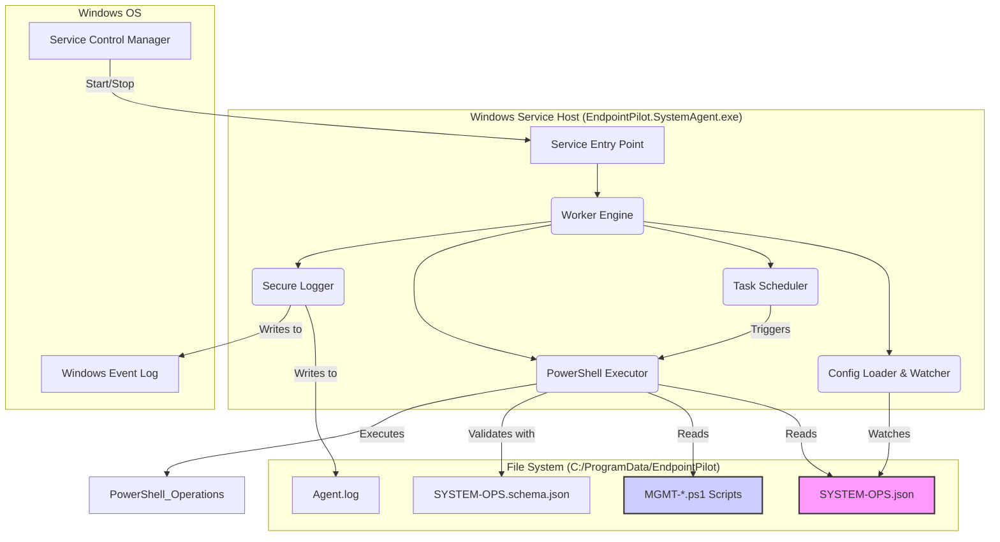

# Plan: EndpointPilot System Agent

## 1. Overview and Goal

This document outlines the architecture for a Windows Service-based "System Agent" for EndpointPilot. The goal is to create a robust, persistent agent that can perform endpoint management tasks requiring elevated privileges (`NT AUTHORITY\SYSTEM`). This moves EndpointPilot beyond user-centric configuration into full system management.

## 2. Technology Selection

-   **Service Framework:** .NET 8+ Worker Service
-   **Language:** C#
-   **PowerShell Hosting:** `System.Management.Automation` SDK (in-process hosting)

## 3. High-Level Architecture

The agent will be a .NET Windows Service that runs with `SYSTEM` privileges. Its primary job is to host the PowerShell runtime, monitor a secure directory for a new `SYSTEM-OPS.json` directive file, and execute the operations defined within it.

## 4. Service Components

-   **Service Entry Point (`Program.cs`)**: Standard .NET Worker Service entry point. Configures and starts the service host.
-   **Worker Engine (`AgentWorker.cs`)**: The core class of the service. It orchestrates the other components. On start, it initializes the logger, config loader, and scheduler.
-   **Config Loader & Watcher**:
    -   Responsible for reading `SYSTEM-OPS.json` from `C:\ProgramData\EndpointPilot`.
    -   Uses a `FileSystemWatcher` to monitor the file for changes, allowing the service to react to updated instructions without a restart.
-   **Task Scheduler**:
    -   Triggers the execution of tasks based on a defined schedule (e.g., from a new `AGENT-CONFIG.json`).
    -   Can be implemented with a `PeriodicTimer` for simple recurrence or a library like Quartz.NET for cron-like scheduling.
-   **PowerShell Executor**:
    -   The heart of the agent. Uses the `System.Management.Automation.PowerShell` class to create and manage a PowerShell runspace.
    -   Loads the existing `MGMT-*.ps1` helper scripts into its runspace.
    -   When triggered, it reads operations from `SYSTEM-OPS.json`, validates them against the schema, and invokes the appropriate PowerShell functions.
-   **Secure Logger**:
    -   Logs all significant events, operations, and errors to two destinations:
        1.  The **Windows Event Log** (Application channel, under an "EndpointPilot" source).
        2.  A local log file (`C:\ProgramData\EndpointPilot\Agent.log`) for detailed debugging.

## 5. Security & Installation

-   **Installation Process:** The main `Install-EndpointPilotAdmin.ps1` script will be updated to handle the service installation:
    1.  Copy the service executable and its dependencies to a secure location (e.g., `C:\Program Files\EndpointPilot Agent\`).
    2.  Create the `C:\ProgramData\EndpointPilot` directory for configurations and logs.
    3.  **Apply strict Access Control Lists (ACLs)** to both directories, granting only `SYSTEM` and `Administrators` write access to prevent tampering by standard users.
    4.  Use the `New-Service` PowerShell cmdlet to register the executable as a Windows Service.
    5.  Configure the service to run as `NT AUTHORITY\SYSTEM` and to start automatically.
-   **Directive File:** A new `SYSTEM-OPS.json` file will be introduced specifically for system-level tasks. This ensures a clear separation between user-level and system-level configurations.

## 6. Phased Development Plan

1.  **Phase 1: Core Service Framework**
    -   Create the .NET Worker Service project.
    -   Implement the basic service lifecycle (start, stop) and logging to the Windows Event Log.
    -   Develop and test the installer logic in the main install script.

2.  **Phase 2: PowerShell Integration**
    -   Implement the `PowerShell Executor` component.
    -   Create a proof-of-concept that can successfully load and run a simple function from an existing `MGMT-*.psm1` module.

3.  **Phase 3: Configuration & Execution**
    -   Define the initial schema for `SYSTEM-OPS.json`.
    -   Implement the `Config Loader & Watcher` to monitor the directive file.
    -   Build the core logic to parse the JSON and trigger the corresponding PowerShell functions within the hosted runspace.