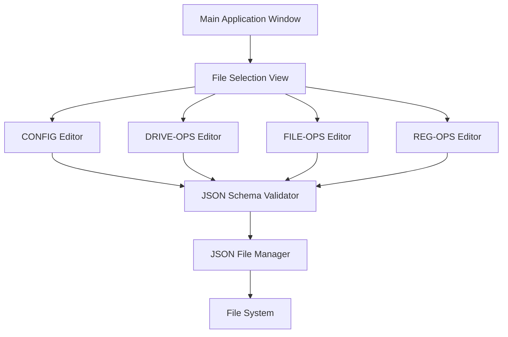
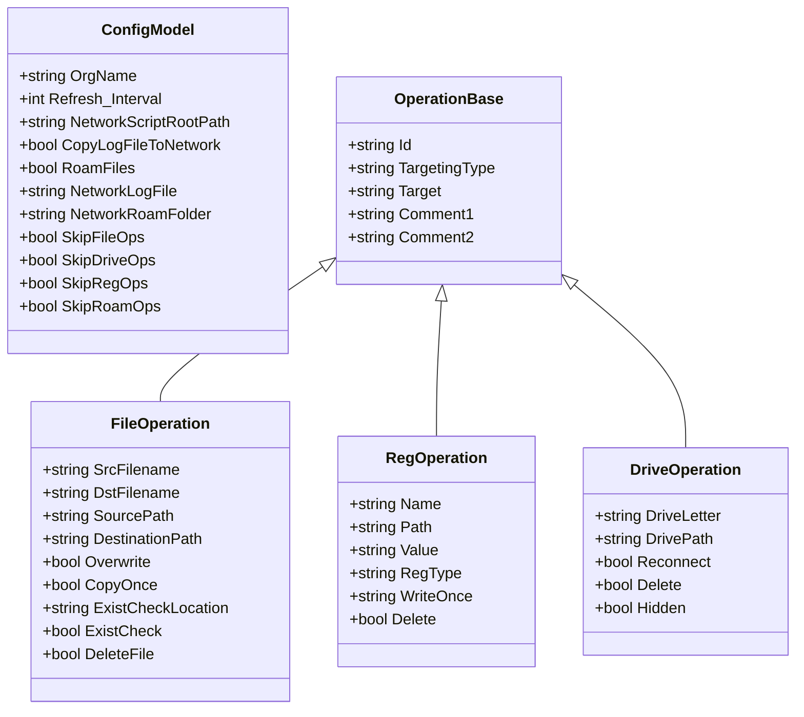

# EndpointPilot JSON Editor Tool - Detailed Plan

## 1. Overview and Goals

### Primary Goals:
- Establish a dedicated tool for editing EndpointPilot's 4 configuration-directive JSON files
- Provide a user-friendly interface for IT Admins with basic technical skills
- Prevent JSON syntax errors and validate against schema files
- Allow easy addition, modification, and removal of entries
- Support the specific structure of each configuration file type

### Target Files:
- CONFIG.json
- DRIVE-OPS.json
- FILE-OPS.json
- REG-OPS.json

## 2. Technology Selection

We're going to initially use **WPF (Windows Presentation Foundation)** with **.NET 8+** for the following reasons:

1. **Modern UI Capabilities**: WPF provides better UI design flexibility than WinForms
2. **MVVM Architecture**: Supports clean separation of UI and business logic
3. **Data Binding**: Powerful data binding capabilities for JSON objects
4. **Styling and Templating**: Better customization of UI elements
5. **Long-term Support**: .NET 9 assures this app would function for a long time to come.

## 3. Application Architecture



### Key Components:

1. **Main Application Window**: The entry point with navigation to different editors
2. **File Selection View**: Allows selecting which configuration file to edit
3. **Specialized Editors**: Custom editors for each JSON file type
4. **JSON Schema Validator**: Validates JSON against schema files
5. **JSON File Manager**: Handles reading and writing JSON files

## 4. User Interface Design

### Main Window
- Simple, clean interface with clear navigation
- File selection panel on the left
- Main editing area on the right
- Status bar for validation messages

### CONFIG Editor
- Form-based interface with labeled fields for each property
- Toggle switches for boolean values
- Text fields for strings and numbers
- Validation indicators next to each field

### Operation Editors (DRIVE-OPS, FILE-OPS, REG-OPS)
- List view showing all operations with key information
- Add/Edit/Remove buttons for operations
- Detail panel for editing selected operation
- Form-based editing with appropriate controls for each property type
- Validation indicators and help text

## 5. Features and Functionality

### Core Features:

1. **Guided Editing**:
   - Form-based interface with appropriate controls for each data type
   - Dropdown menus for enumerated values (e.g., targeting_type)
   - Toggle switches for boolean values
   - Validation as you type

2. **Operation Management**:
   - Add new operations with pre-filled defaults
   - Duplicate existing operations
   - Remove operations
   - Reorder operations

3. **Validation**:
   - Real-time validation against JSON schemas
   - Visual indicators for validation errors
   - Detailed error messages
   - Prevention of saving invalid configurations

4. **File Management**:
   - Open and save JSON files
   - Create backups before saving
   - Restore from backups
   - Export/import operations

5. **User Assistance**:
   - Context-sensitive help
   - Tooltips explaining each field
   - Documentation panel
   - Example values

### Advanced Features:

1. **Templates**:
   - Predefined templates for common operations
   - Save custom templates
   - Apply templates to create new operations

2. **Bulk Operations**:
   - Import multiple operations at once
   - Bulk edit properties across multiple operations
   - Filter and search operations

3. **Comparison**:
   - Compare configurations between files
   - Highlight differences
   - Merge changes

## 6. Implementation Details

### Data Models



### Schema Validation

- Using `Newtonsoft.Json.Schema` for JSON schema validation
- Load schema files at application startup
- Validate JSON objects before saving
- Provide detailed validation error messages

### File Operations

- Using `System.IO` for file operations
- Create backup of JSON file before saving
- Handle file locking and access issues
- Support relative and absolute paths

## 7. Development Phases

### Phase 1: Core Framework and CONFIG Editor
- Set up WPF project structure
- Implement JSON file loading and saving
- Create data models
- Implement schema validation
- Develop CONFIG editor UI and functionality
- Basic error handling and logging

### Phase 2: Operation Editors
- Develop DRIVE-OPS editor
- Develop FILE-OPS editor
- Develop REG-OPS editor
- Implement operation management (add/edit/remove)
- Enhance validation with field-level feedback

### Phase 3: Advanced Features and Refinement (coming later)
- Implement templates for new JSON files
- Consider adding bulk operations
- Maybe develop comparison functionality
- Refine UI/UX based on testing
- Possibly add context-sensitive help
- Comprehensive error handling

### Phase 4: Testing and Refinement for mature Deployment
- Unit testing
- Integration testing
- Packaging and deployment
- Documentation

## 8. User Experience Considerations

### For IT Admins with Basic Skills:
- Minimize exposure to JSON syntax
- Use familiar IT admin terminology (registry keys, file paths, etc.)
- Provide clear visual feedback for validation
- Include helpful descriptions and examples
- Prevent common mistakes through UI design / validation
- Confirm destructive actions (delete, overwrite)

### UI/UX Principles:
- Clear navigation and workflow
- Consistent layout and controls
- Visual hierarchy of information
- Responsive feedback
- Error prevention over error correction
- Progressive disclosure of advanced features

## 9. Sample UI Mockups

### Main Window with File Selection
```
+--------------------------------------+
| EndpointPilot JSON Editor           |
+--------------------------------------+
| Files:  | [Selected File Editor]     |
| [x] CONFIG.json                      |
| [ ] DRIVE-OPS.json                   |
| [ ] FILE-OPS.json                    |
| [ ] REG-OPS.json                     |
|         |                            |
|         |                            |
|         |                            |
|         |                            |
+--------------------------------------+
| Status: Ready                        |
+--------------------------------------+
```

### Operation Editor (e.g., FILE-OPS)
```
+--------------------------------------+
| EndpointPilot JSON Editor - FILE-OPS |
+--------------------------------------+
| Files:  | Operations:    | [Details] |
| [ ] CON | + Add New      | ID: 001   |
| [ ] DRI | - Remove       | Source:   |
| [x] FIL | ↑ Move Up      | [_______] |
| [ ] REG | ↓ Move Down    | Dest:     |
|         |                | [_______] |
|         | [001] example1 | Overwrite:|
|         | [002] example2 | [x] Yes   |
|         | [003] example3 | [ ] No    |
|         |                |           |
+--------------------------------------+
| Status: Valid configuration          |
+--------------------------------------+
```

## 10. Technical Requirements

### Development Environment:
- Visual Studio 2022
- .NET 9 SDK
- NuGet packages:
  - Newtonsoft.Json
  - Newtonsoft.Json.Schema
  - MaterialDesignThemes (for current style UI)

### Deployment Requirements:
- Windows 10/11
- .NET 9 Runtime
- Local file system access
- Administrator privileges (optional, for certain operations)

## 11. Risks and Mitigation

| Risk | Impact | Mitigation |
|------|--------|------------|
| JSON schema changes | Medium | Design for schema extensibility, version checking |
| File access permissions | High | Clear error messages, elevation prompts |
| Complex validation rules | Medium | Progressive validation, clear feedback |
| User resistance to new tool | Medium | Intuitive UI, documentation, training |
| Data corruption | High | Automatic backups, validation before save |

## 12. Initial Steps (DONE)

1. Set up WPF project structure
2. Implement core data models and JSON handling
3. Create the main application UI
4. Implement the CONFIG editor
5. Add schema validation
6. Test and refine
7. Package for deployment
