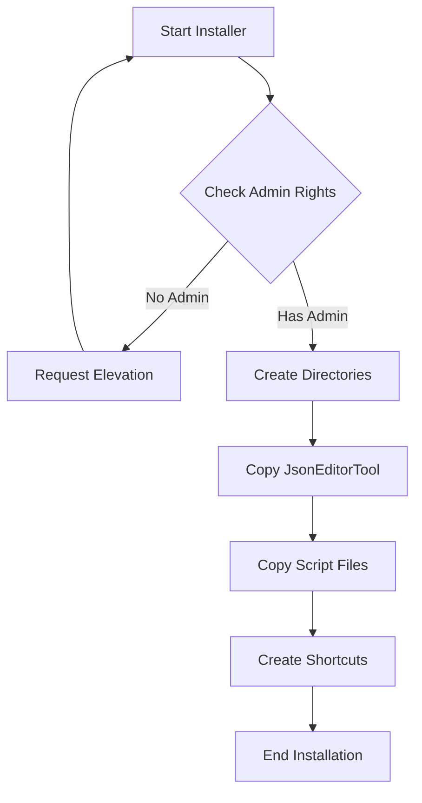
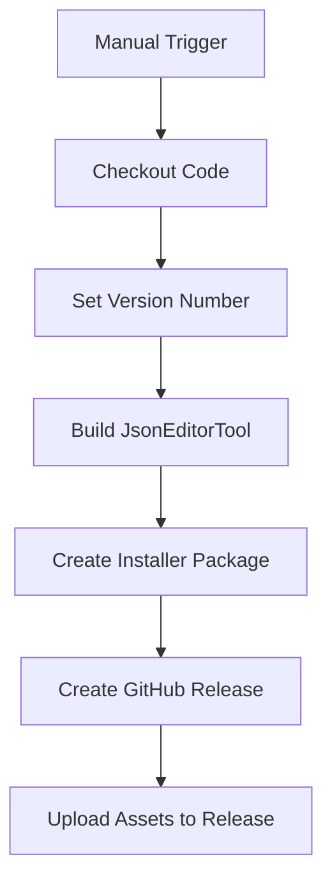

# EndpointPilot Packaging and Release Plan

Here is the comprehensive plan for creating a packaging solution and GitHub release workflow for this project.

## Project and installer need

EndpointPilot is a PowerShell-based Windows Endpoint Configuration solution that:
- Runs as a scheduled task at specified intervals
- Manages user profiles on Endpoints in Office and emote Work scenarios
- Uses JSON configuration files to direct operations
- Includes a .NET-based JSON editor tool to manage the JSON config files

## Requirements Summary

1. **Single Installer**:
   - Install JsonEditorTool to `%PROGRAMDATA%\EndpointPilot\JsonEditorTool\`
   - Install main scripts (.ps1, .psm1, .psd1, .json, .cmd, .exe, .vbs) to `%PROGRAMDATA%\EndpointPilot\`
   - Run with admin rights

2. **Cost Constraints**:
   - Free or low-cost solution (open-source project)
   - No commercial installer solutions wanted at this time

3. **GitHub Release Integration**:
   - Semi-automated approach
   - Manually trigger GitHub Actions workflow
   - Automatically build installer and create release

## Installer Solution Options

Below is the first method J-DubApps will use to distribute this solution, with pros/cons on the solutions I am skipping for now:

### 1. PowerShell-based Installer (Current)

**Why PowerShell:**
- Native to the project's technology stack
- Complete control over installation process
- No external dependencies
- Easy to maintain and update
- Can be easily integrated with GitHub Actions

**Caveats:**
- Requires script execution policy to be set appropriately
- Less polished UI compared to dedicated installer frameworks

### 3. WiX Toolset (Windows Installer XML) - ***skipped for now***

**Pros:**
- Creates standard MSI packages
- Enterprise-grade solution
- Extensive capabilities

**Cons:**
- Steep learning curve (maybe later - sysadmins just like .msi)
- XML-based configuration can be verbose
- More complex build process

## Approach At Launch-Time

 **EndpointPilot** (being a PowerShell-based solution) will first use a **PowerShell-based installer** for the following reasons:
1. Aligns with the technology stack
2. Simplest to implement and maintain, early on
3. No additional dependencies or costs
4. Easy integration with GitHub Actions
5. Full control over the installation process

## Detailed Implementation Plan

### 1. PowerShell Installer Script

I will write a PowerShell script (`Install-EndpointPilotAdmin.ps1`) that:



The installer will:
1. Check for and request admin rights if needed
2. Create necessary directories
3. Copy JsonEditorTool files to `%PROGRAMDATA%\EndpointPilot\JsonEditorTool\`
4. Copy script files to `%PROGRAMDATA%\EndpointPilot\`
5. Create any shortcuts (optional)
6. Display completion message

### 2. GitHub Actions Workflow

J-DubApps (me) is working on a GitHub Actions workflow file (`.github/workflows/release.yml`) that will eventually:



The workflow will:
1. Be manually triggered with a version input
2. Check out the latest code
3. Build the JsonEditorTool (if needed)
4. Package all components into a ZIP file
5. Create a GitHub release with the specified version
6. Upload the installer to the release

### 3. Downloader Script

J-DubApps (me) will also create a small PowerShell script that:
1. Downloads the latest release from GitHub
2. Extracts and runs the installer

This provides an easy one-line installation command for most sysadmins to get up-and-running to evalute if EndPointPilot is for them.

## Implementation Details

### PowerShell Installer Script

```powershell
<# 
.SYNOPSIS
    Installer for EndpointPilot
.DESCRIPTION
    Installs EndpointPilot components to the appropriate locations
#>
[CmdletBinding()]
param()

# Ensure running as administrator
if (-not ([Security.Principal.WindowsPrincipal][Security.Principal.WindowsIdentity]::GetCurrent()).IsInRole([Security.Principal.WindowsBuiltInRole]::Administrator)) {
    Write-Warning "This script requires administrator privileges. Attempting to elevate..."
    Start-Process powershell.exe "-NoProfile -ExecutionPolicy Bypass -File `"$PSCommandPath`"" -Verb RunAs
    exit
}

# Define installation paths
$programDataPath = [Environment]::GetFolderPath('CommonApplicationData')
$baseInstallPath = Join-Path -Path $programDataPath -ChildPath "EndpointPilot"
$jsonEditorToolPath = Join-Path -Path $baseInstallPath -ChildPath "JsonEditorTool"

# Create directories if they don't exist
Write-Host "Creating installation directories..." -ForegroundColor Cyan
if (-not (Test-Path -Path $baseInstallPath)) {
    New-Item -Path $baseInstallPath -ItemType Directory -Force | Out-Null
}
if (-not (Test-Path -Path $jsonEditorToolPath)) {
    New-Item -Path $jsonEditorToolPath -ItemType Directory -Force | Out-Null
}

# Install JsonEditorTool
Write-Host "Installing JsonEditorTool..." -ForegroundColor Cyan
$jsonEditorSourcePath = Join-Path -Path $PSScriptRoot -ChildPath "JsonEditorTool\publish"
Copy-Item -Path "$jsonEditorSourcePath\*" -Destination $jsonEditorToolPath -Recurse -Force

# Install script files
Write-Host "Installing EndpointPilot scripts..." -ForegroundColor Cyan
$scriptExtensions = @("*.ps1", "*.psm1", "*.psd1", "*.json", "*.cmd", "*.exe", "*.vbs")
foreach ($extension in $scriptExtensions) {
    $files = Get-ChildItem -Path $PSScriptRoot -Filter $extension -File
    foreach ($file in $files) {
        Copy-Item -Path $file.FullName -Destination $baseInstallPath -Force
    }
}

# Create desktop shortcut (optional)
$createShortcut = Read-Host "Create desktop shortcut for JsonEditorTool? (Y/N)"
if ($createShortcut -eq "Y" -or $createShortcut -eq "y") {
    $WshShell = New-Object -ComObject WScript.Shell
    $Shortcut = $WshShell.CreateShortcut("$env:PUBLIC\Desktop\EndpointPilot JSON Editor.lnk")
    $Shortcut.TargetPath = Join-Path -Path $jsonEditorToolPath -ChildPath "EndpointPilotJsonEditor.App.exe"
    $Shortcut.Save()
    Write-Host "Desktop shortcut created." -ForegroundColor Green
}

Write-Host "EndpointPilot installation complete!" -ForegroundColor Green
Write-Host "JsonEditorTool installed to: $jsonEditorToolPath" -ForegroundColor Yellow
Write-Host "Scripts installed to: $baseInstallPath" -ForegroundColor Yellow
```

### GitHub Actions Workflow

```yaml
name: Create Release

on:
  workflow_dispatch:
    inputs:
      version:
        description: 'Release version (e.g., 1.0.0)'
        required: true
      prerelease:
        description: 'Is this a prerelease?'
        type: boolean
        default: false

jobs:
  build:
    runs-on: windows-latest
    steps:
      - name: Checkout code
        uses: actions/checkout@v3

      - name: Setup .NET
        uses: actions/setup-dotnet@v3
        with:
          dotnet-version: '6.0.x'

      - name: Build JsonEditorTool
        run: |
          cd JsonEditorTool
          dotnet publish EndpointPilotJsonEditor.App/EndpointPilotJsonEditor.App.csproj -c Release -o publish

      - name: Create installer package
        run: |
          # Create the installer script
          $installerContent = Get-Content -Path .github/workflows/Install-EndpointPilotAdmin.ps1 -Raw
          Set-Content -Path Install-EndpointPilotAdmin.ps1 -Value $installerContent

          # Create release package
          $releaseDir = "EndpointPilot-${{ github.event.inputs.version }}"
          New-Item -Path $releaseDir -ItemType Directory
          
          # Copy files to release directory
          Copy-Item -Path "*.ps1" -Destination $releaseDir
          Copy-Item -Path "*.psm1" -Destination $releaseDir
          Copy-Item -Path "*.psd1" -Destination $releaseDir
          Copy-Item -Path "*.json" -Destination $releaseDir
          Copy-Item -Path "*.cmd" -Destination $releaseDir
          Copy-Item -Path "*.exe" -Destination $releaseDir
          Copy-Item -Path "*.vbs" -Destination $releaseDir
          Copy-Item -Path "JsonEditorTool" -Destination $releaseDir -Recurse
          
          # Create ZIP file
          Compress-Archive -Path $releaseDir -DestinationPath "EndpointPilot-${{ github.event.inputs.version }}.zip"
        shell: pwsh

      - name: Create GitHub Release
        id: create_release
        uses: actions/create-release@v1
        env:
          GITHUB_TOKEN: ${{ secrets.GITHUB_TOKEN }}
        with:
          tag_name: v${{ github.event.inputs.version }}
          release_name: EndpointPilot v${{ github.event.inputs.version }}
          draft: false
          prerelease: ${{ github.event.inputs.prerelease }}

      - name: Upload Release Asset
        uses: actions/upload-release-asset@v1
        env:
          GITHUB_TOKEN: ${{ secrets.GITHUB_TOKEN }}
        with:
          upload_url: ${{ steps.create_release.outputs.upload_url }}
          asset_path: ./EndpointPilot-${{ github.event.inputs.version }}.zip
          asset_name: EndpointPilot-${{ github.event.inputs.version }}.zip
          asset_content_type: application/zip
```

### Downloader Script (Optional)

```powershell
<#
.SYNOPSIS
    Installer for EndpointPilot Core Scripts
.DESCRIPTION
    Downloads the latest EndpointPilot source from GitHub and installs
    the core script files to %PROGRAMDATA%\EndpointPilot\.
    Requires Administrator privileges to write to %PROGRAMDATA%. Does NOT install the JsonEditorTool.
.NOTES
    Author: Julian West
    Version: 1.0.0 (Non-Admin)
    Requires: PowerShell 5.1 or later, Administrator privileges
#>
[CmdletBinding()]
param()


Function WriteLog($LogString) {
    ##########################################################################
    ##	Writes Run info to a logfile set in $LogFile variable
    ##########################################################################

    #Param ([string]$LogString)
    $Stamp = (Get-Date).toString("yyyy/MM/dd HH:mm:ss")
    $LogMessage = "$Stamp $LogString"
    Add-content $LogFile -value $LogMessage
}

# Ensure running as administrator
if (-not ([Security.Principal.WindowsPrincipal][Security.Principal.WindowsIdentity]::GetCurrent()).IsInRole([Security.Principal.WindowsBuiltInRole]::Administrator)) {
    Write-Warning "This script requires administrator privileges to write to %PROGRAMDATA%. Attempting to elevate..."
    WriteLog "WARNING: This script requires administrator privileges to write to %PROGRAMDATA%. Attempting to elevate..."
    Start-Process powershell.exe "-NoProfile -ExecutionPolicy Bypass -File `"$PSCommandPath`"" -Verb RunAs
    exit
}

$LogFile = Join-Path -Path $env:windir -ChildPath "Temp\EPilot-Install-$env:computername.log"

# region OS Architecture
# Determine the OS Architecture (x64, x86, or Arm64)
# This code works in both Windows PowerShell 5.1 (Desktop) and PowerShell Core

# If running under WOW64 (32-bit process on a 64-bit OS), $env:PROCESSOR_ARCHITEW6432 will be defined.
if ($env:PROCESSOR_ARCHITEW6432) {
    $arch = $env:PROCESSOR_ARCHITEW6432
} else {
    $arch = $env:PROCESSOR_ARCHITECTURE
}

# Map the raw architecture value to a friendly output.
switch ($arch) {
    "AMD64" { $archFriendly = "x64" }
    "x86"   { $archFriendly = "x86 (32-bit)" }
    "ARM64" { $archFriendly = "Arm64" }
    default { $archFriendly = "Unknown Architecture ($arch)" }
}
# endregion OS Architecture
# Write-Output "Detected Operating System Architecture: $archFriendly"

If ($archFriendly -eq "x86 (32-bit)") {
    Write-Warning "This script is not supported on 32-bit systems. Please use a 64-bit version of PowerShell."
    WriteLog "WARNING: This script is not supported on 32-bit systems. Please use a 64-bit version of PowerShell."
    exit
}

# Define source and temporary paths
$githubRepoUrl = "https://github.com/J-DubApps/EndpointPilot/archive/refs/heads/main.zip"
$tempDir = Join-Path -Path $env:windir -ChildPath "Temp\EPilotTmp"
$zipFilePath = Join-Path -Path $tempDir -ChildPath "EndpointPilot-main.zip" # Consistent naming
$stagingSourcePath = $null # Will be set after extraction

# --- Download and Extract ---
Write-Host "Preparing temporary staging area..." -ForegroundColor Cyan
WriteLog "Preparing temporary staging area..."

# Create Temp Directory
try {
    if (Test-Path -Path $tempDir) {
        Write-Host "Removing existing temporary directory: $tempDir" -ForegroundColor Yellow
        WriteLog "Removing existing temporary directory: $tempDir"
        Remove-Item -Path $tempDir -Recurse -Force -ErrorAction Stop
    }
    Write-Host "Creating temporary directory: $tempDir"
    WriteLog "Creating temporary directory: $tempDir"
    New-Item -Path $tempDir -ItemType Directory -Force -ErrorAction Stop | Out-Null
} catch {
    Write-Error "Failed to create temporary directory '$tempDir'. Error: $($_.Exception.Message)"
    WriteLog "ERROR: Failed to create temporary directory '$tempDir'. Error: $($_.Exception.Message)"
    exit 1
}

# Download Zip
try {
    Write-Host "Downloading EndpointPilot source from $githubRepoUrl..."
    WriteLog "Downloading EndpointPilot source from $githubRepoUrl..."
    Invoke-WebRequest -Uri $githubRepoUrl -OutFile $zipFilePath -UseBasicParsing -ErrorAction Stop
    Write-Host "Download complete: $zipFilePath" -ForegroundColor Green
    WriteLog "Download complete: $zipFilePath"
} catch [System.Net.WebException] {
    Write-Error "Failed to download file from '$githubRepoUrl'. Status: $($_.Exception.Response.StatusCode). Error: $($_.Exception.Message)"
    WriteLog "ERROR: Failed to download file from '$githubRepoUrl'. Status: $($_.Exception.Response.StatusCode). Error: $($_.Exception.Message)"
    # Clean up partial download if it exists
    if (Test-Path -Path $zipFilePath) { Remove-Item -Path $zipFilePath -Force }
    # Clean up temp dir
    if (Test-Path -Path $tempDir) { Remove-Item -Path $tempDir -Recurse -Force }
    exit 1
} catch {
    Write-Error "An unexpected error occurred during download. Error: $($_.Exception.Message)"
    WriteLog "ERROR: An unexpected error occurred during download. Error: $($_.Exception.Message)"
    # Clean up partial download if it exists
    if (Test-Path -Path $zipFilePath) { Remove-Item -Path $zipFilePath -Force }
    # Clean up temp dir
    if (Test-Path -Path $tempDir) { Remove-Item -Path $tempDir -Recurse -Force }
    exit 1
}

# Extract Zip
try {
    Write-Host "Extracting archive $zipFilePath to $tempDir..."
    WriteLog "Extracting archive $zipFilePath to $tempDir..."
    Expand-Archive -Path $zipFilePath -DestinationPath $tempDir -Force -ErrorAction Stop
    Write-Host "Extraction complete." -ForegroundColor Green
    WriteLog "Extraction complete."
} catch {
    Write-Error "Failed to extract archive '$zipFilePath'. Error: $($_.Exception.Message)"
    WriteLog "ERROR: Failed to extract archive '$zipFilePath'. Error: $($_.Exception.Message)"
    # Clean up zip and temp dir
    if (Test-Path -Path $zipFilePath) { Remove-Item -Path $zipFilePath -Force }
    if (Test-Path -Path $tempDir) { Remove-Item -Path $tempDir -Recurse -Force }
    exit 1
}

# Identify Extracted Folder and Set Staging Path
try {
    $extractedItems = Get-ChildItem -Path $tempDir -Directory -ErrorAction Stop
    if ($extractedItems.Count -ne 1) {
        # Handle case where zip might contain multiple top-level items or none
        $expectedFolderName = "EndpointPilot-main" # Common pattern for GitHub zips
        $potentialPath = Join-Path -Path $tempDir -ChildPath $expectedFolderName
        if (Test-Path -Path $potentialPath -PathType Container) {
             $stagingSourcePath = $potentialPath
        } else {
            throw "Expected exactly one directory or '$expectedFolderName' after extraction, but structure is different. Contents: $($extractedItems.Name -join ', ')"
        }
    } else {
         $stagingSourcePath = $extractedItems[0].FullName
    }

    if (-not (Test-Path -Path $stagingSourcePath -PathType Container)) {
        throw "Determined staging source path '$stagingSourcePath' does not exist or is not a directory."
    }
    Write-Host "Staging source path set to: $stagingSourcePath" -ForegroundColor Green
    WriteLog "Staging source path set to: $stagingSourcePath"

} catch {
    Write-Error "Failed to identify the extracted source directory in '$tempDir'. Error: $($_.Exception.Message)"
    WriteLog "ERROR: Failed to identify the extracted source directory in '$tempDir'. Error: $($_.Exception.Message)"
    # Clean up zip and temp dir
    if (Test-Path -Path $zipFilePath) { Remove-Item -Path $zipFilePath -Force }
    if (Test-Path -Path $tempDir) { Remove-Item -Path $tempDir -Recurse -Force }
    exit 1
}

# Cleanup downloaded zip file now that it's extracted
Write-Host "Removing downloaded zip file: $zipFilePath"
WriteLog "Removing downloaded zip file: $zipFilePath"
Remove-Item -Path $zipFilePath -Force
# --- End Download and Extract ---

# Define installation paths
$programDataPath = [Environment]::GetFolderPath('CommonApplicationData')
$baseInstallPath = Join-Path -Path $programDataPath -ChildPath "EndpointPilot"

# --- Start Main Installation ---
try {
    # Create directories if they don't exist
    Write-Host "Creating installation directory..." -ForegroundColor Cyan
    WriteLog "Creating installation directory..."
    if (-not (Test-Path -Path $baseInstallPath)) {
        New-Item -Path $baseInstallPath -ItemType Directory -Force | Out-Null
    }

    # Install script files
    Write-Host "Installing EndpointPilot scripts..." -ForegroundColor Cyan
    WriteLog "Installing EndpointPilot scripts..."
    $scriptExtensions = @("*.ps1", "*.psm1", "*.psd1", "*.json", "*.cmd", "*.exe", "*.vbs")
    $filesInstalled = 0

    foreach ($extension in $scriptExtensions) {
        $files = Get-ChildItem -Path $stagingSourcePath -Filter $extension -File
        foreach ($file in $files) {
            # Skip the installer itself
            if ($file.Name -eq "Install-EndpointPilot.ps1") { # Ensure we skip the correct installer name
                continue
            }
           
            Copy-Item -Path $file.FullName -Destination $baseInstallPath -Force
            $filesInstalled++
        }
    }

    Write-Host "Installed $filesInstalled script files." -ForegroundColor Green
    WriteLog "Installed $filesInstalled script files."

    # Installation summary
    Write-Host "`nEndpointPilot Core Scripts installation complete!" -ForegroundColor Green
    WriteLog "`nEndpointPilot Core Scripts installation complete!"
    Write-Host "Scripts installed to: $baseInstallPath" -ForegroundColor Yellow
    WriteLog "Scripts installed to: $baseInstallPath"

    # Optional: Create uninstaller
    $createUninstaller = Read-Host "Create uninstaller script? (Y/N)"
    if ($createUninstaller -eq "Y" -or $createUninstaller -eq "y") {
        $uninstallerPath = Join-Path -Path $baseInstallPath -ChildPath "Uninstall-EndpointPilot.ps1"
       
        $uninstallerContent = @"
<#
.SYNOPSIS
    Uninstaller for EndpointPilot Core Scripts
.DESCRIPTION
    Removes EndpointPilot Core Scripts components from the system.
    This does NOT remove the JsonEditorTool if installed separately.
#>
[CmdletBinding()]
param()

# Define installation paths
`$programDataPath = [Environment]::GetFolderPath('CommonApplicationData')
`$baseInstallPath = Join-Path -Path `$programDataPath -ChildPath "EndpointPilot"

# Remove installation directories
if (Test-Path -Path `$baseInstallPath) {
    Write-Host "Removing EndpointPilot Core Scripts files..." -ForegroundColor Cyan
    Remove-Item -Path `$baseInstallPath -Recurse -Force
}

Write-Host "EndpointPilot Core Scripts have been uninstalled." -ForegroundColor Green
"@
        
        Set-Content -Path $uninstallerPath -Value $uninstallerContent
        Write-Host "Uninstaller created at: $uninstallerPath" -ForegroundColor Green
        WriteLog "Uninstaller created at: $uninstallerPath"
    }
} # End Try block
finally {
    Write-Host "`nPerforming cleanup..." -ForegroundColor Cyan
    WriteLog "`nPerforming cleanup..."
    if ($null -ne $tempDir -and (Test-Path -Path $tempDir)) {
        Write-Host "Removing temporary directory: $tempDir"
        WriteLog "Removing temporary directory: $tempDir"
        Remove-Item -Path $tempDir -Recurse -Force
        Write-Host "Temporary directory removed." -ForegroundColor Green
        WriteLog "Temporary directory removed."
    } else {
        Write-Host "Temporary directory path is invalid or not found, skipping removal." -ForegroundColor Yellow
        WriteLog "Temporary directory path is invalid or not found, skipping removal."
    }
}
# --- End Main Installation ---

Write-Host "`nThank you for installing EndpointPilot Core Scripts!" -ForegroundColor Cyan
WriteLog "`nThank you for installing EndpointPilot Core Scripts!"
```

## GitHub Release Strategy

The GitHub release process will work as follows:

1. When ready to create a new release, J-DubApps will manually trigger the GitHub Actions workflow
2. The workflow prompts for a version number and whether it's a prerelease
3. GitHub Actions builds the JsonEditorTool, packages all components, and creates a release
4. The release includes:
   - The installer package (ZIP file)
   - Release notes (automatically generated from commit messages or manually added)
   - Version information

## Next Steps

1. **Create the installer script** (`Install-EndpointPilotAdmin.ps1`)
2. **Set up the GitHub Actions workflow** (`.github/workflows/release.yml`)
3. **Test the installation process** on different Windows versions
4. **Create documentation** for the installation process
5. **Implement the optional downloader script** for easy installation

## Future Enhancements

1. **Versioning system**: Automatically increment version numbers based on semantic versioning
2. **Changelog generation**: Automatically generate release notes from commit messages
3. **Installation verification**: Add checks to verify successful installation
4. **Uninstaller**: Maybe create an uninstaller script (if we haven't converted to MSI)
5. **Update mechanism**: Add ability to check for and install updates
